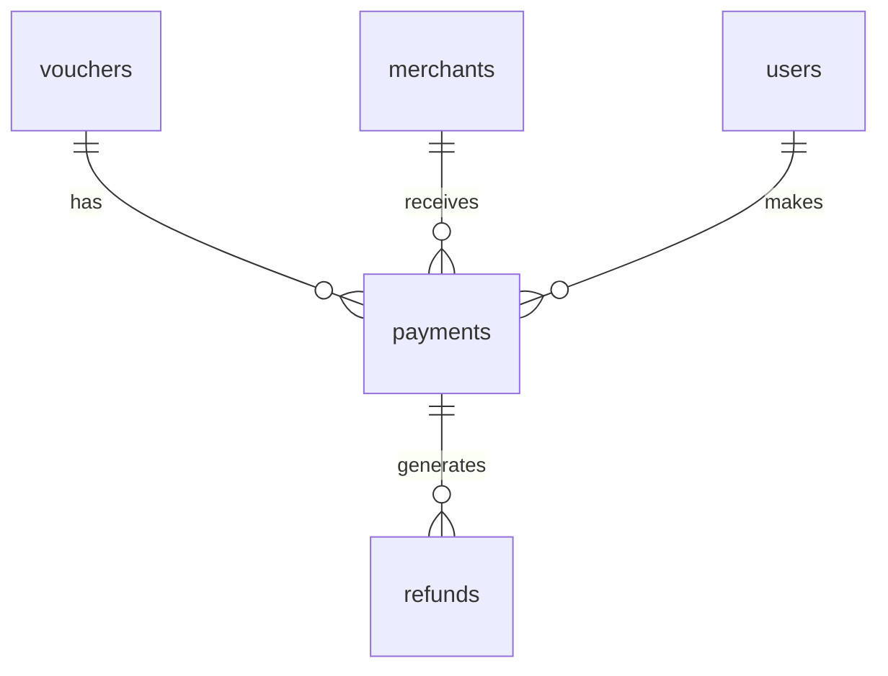

# 반제품 스펙 설계 문서

> **Summary**: AI Foundry 역공학 결과물(D1 policies/ontologies/skills)을 6개 스펙 문서로 변환하는 포맷을 설계하고, LPON 결제 취소 파일럿의 구체적 변환 로직을 정의한다.
>
> **Project**: AI Foundry
> **Version**: v0.6.0
> **Author**: Sinclair Seo
> **Date**: 2026-03-19
> **Status**: Active
> **Planning Doc**: [req-027-semi-finished-spec.plan.md](../01-plan/features/req-027-semi-finished-spec.plan.md)

---

## 1. Overview

### 1.1 Design Goals

1. **변환 가능성**: AI Foundry D1/R2의 기존 데이터를 직접 쿼리하여 6개 스펙 문서를 생성할 수 있는 구조
2. **이중 가독성**: 사람(본부장)이 읽고 판단 + AI Agent(Claude Code)가 파싱하여 코드 생성 — 동일 문서
3. **상호 참조 무결성**: BL-NNN ↔ FN-NNN ↔ API-NNN ↔ 테이블명 간 크로스 레퍼런스
4. **스택 중립성**: 특정 프레임워크에 종속되지 않는 스펙 (Claude Code에 스택 선택 위임)

### 1.2 Design Principles

- **데이터 주도**: AI Foundry에 이미 축적된 데이터(policies, terms, skills)를 최대한 활용, 수동 작성 최소화
- **점진적 정제**: 자동 추출 → 사람 검토 → AI 생성 검증의 3단계 루프
- **단일 진실 원천**: 각 정보는 하나의 문서에만 정의, 나머지는 참조(ID 기반)

---

## 2. Architecture

### 2.1 변환 파이프라인

```
┌──────────────────────────────────────────────────────────────────┐
│                    AI Foundry 기존 데이터                          │
│  ┌─────────┐  ┌──────────┐  ┌─────────┐  ┌──────────────────┐   │
│  │db-policy│  │db-ontology│  │db-skill │  │R2 skill-packages│   │
│  │policies │  │ontologies │  │skills   │  │.skill.json      │   │
│  │hitl_*   │  │terms      │  │         │  │                 │   │
│  └────┬────┘  └─────┬─────┘  └────┬────┘  └────────┬────────┘   │
│       │             │              │                │            │
└───────┼─────────────┼──────────────┼────────────────┼────────────┘
        │             │              │                │
        ▼             ▼              ▼                ▼
┌──────────────────────────────────────────────────────────────────┐
│                    변환 단계 (수동 + Claude 보조)                   │
│                                                                  │
│  Step 1: Policy 쿼리 → 비즈니스 로직 명세 (Doc 1)                  │
│  Step 2: Terms/Ontology 쿼리 → 데이터 모델 명세 (Doc 2)            │
│  Step 3: Skill JSON 분석 → 기능 정의서 (Doc 3)                     │
│  Step 4: 종합 → 아키텍처 정의서 (Doc 4)                            │
│  Step 5: 기능→API 매핑 → API 명세 (Doc 5)                          │
│  Step 6: 기능 플로우 → 화면 정의 (Doc 6)                           │
│                                                                  │
└──────────────────────────────┬───────────────────────────────────┘
                               │
                               ▼
┌──────────────────────────────────────────────────────────────────┐
│                    반제품 스펙 (6개 문서)                           │
│  pilot-lpon-cancel/                                              │
│  ├── 01-business-logic.md     ← BL-001 ~ BL-NNN                 │
│  ├── 02-data-model.md         ← CREATE TABLE + ERD              │
│  ├── 03-functions.md          ← FN-001 ~ FN-NNN                 │
│  ├── 04-architecture.md       ← 레이어/모듈/인증                  │
│  ├── 05-api.md                ← API-001 ~ API-NNN               │
│  └── 06-screens.md            ← 와이어프레임                      │
└──────────────────────────────┬───────────────────────────────────┘
                               │
                               ▼
┌──────────────────────────────────────────────────────────────────┐
│                    Claude Code 입력                               │
│  CLAUDE.md + rules/ + migrations/ + 프롬프트                      │
│                    → Working Version 생성                         │
└──────────────────────────────────────────────────────────────────┘
```

### 2.2 Data Flow: Policy → 비즈니스 로직 명세

```sql
-- Step 1: LPON 결제 취소 관련 정책 추출
SELECT policy_code, title, condition, criteria, outcome,
       source_page_ref, source_excerpt, trust_score
FROM policies
WHERE organization_id = '{LPON_ORG_ID}'
  AND status = 'approved'
  AND (title LIKE '%취소%' OR title LIKE '%환불%' OR title LIKE '%결제%')
ORDER BY policy_code;
```

```
DB 결과                              변환                    스펙 문서
┌─────────────────────┐                                ┌─────────────────────────┐
│ condition: "카드+현금│    Claude가                    │ ## 시나리오: 복합결제 취소 │
│   혼합 결제"         │    시나리오로                   │                         │
│ criteria: "선결제액  │    재구성     ──────────▶      │ ### 비즈니스 룰          │
│   확인 후"           │                               │ | BL-001 | When: 복합결제│
│ outcome: "해당 액수  │                               │ |   취소 요청 | If: 카드+ │
│   환불 처리"         │                               │ |   현금 | Then: 각각 환불│
└─────────────────────┘                                └─────────────────────────┘
```

### 2.3 Data Flow: Terms/Ontology → 데이터 모델

```sql
-- Step 2: LPON 결제 관련 용어 추출
SELECT t.term_id, t.label, t.definition, t.term_type
FROM terms t
JOIN ontologies o ON t.ontology_id = o.ontology_id
WHERE o.organization_id = '{LPON_ORG_ID}'
  AND t.term_type IN ('entity', 'attribute')
  AND (t.label LIKE '%결제%' OR t.label LIKE '%상품권%'
       OR t.label LIKE '%가맹점%' OR t.label LIKE '%환불%')
ORDER BY t.term_type, t.label;
```

```
Terms (entity 타입)                  변환                    데이터 모델
┌─────────────────────┐                                ┌─────────────────────────┐
│ label: "결제"        │                               │ CREATE TABLE payments ( │
│ type: entity         │    Entity→Table               │   id TEXT PRIMARY KEY,  │
│                      │    Attribute→Column ────▶     │   voucher_id TEXT,      │
│ label: "결제금액"    │                               │   amount INTEGER,       │
│ type: attribute      │                               │   method TEXT,          │
│                      │                               │   status TEXT,          │
│ label: "결제수단"    │                               │   ...                   │
│ type: attribute      │                               │ );                      │
└─────────────────────┘                                └─────────────────────────┘
```

### 2.4 Dependencies

| Component | Depends On | Purpose |
|-----------|-----------|---------|
| 비즈니스 로직 명세 | db-policy (policies 테이블) | condition-criteria-outcome → 시나리오 |
| 데이터 모델 명세 | db-ontology (terms, ontologies) | entity/attribute → 테이블/컬럼 |
| 기능 정의서 | 비즈니스 로직 + 데이터 모델 + R2 skill JSON | 통합 기능 단위 구성 |
| 아키텍처 정의서 | 기능 정의서 (모듈 구성 도출) | 시스템 레이어 설계 |
| API 명세 | 기능 정의서 → 엔드포인트 매핑 | REST API 상세 |
| 화면 정의 | 기능 정의서 (사용자 플로우) | UI 와이어프레임 |

---

## 3. 6개 스펙 문서 상세 설계

### 3.1 Doc 1: 비즈니스 로직 명세 (`01-business-logic.md`)

**입력**: `policies` 테이블 (approved, LPON org)
**변환 규칙**:

| DB 필드 | 스펙 필드 | 변환 방식 |
|---------|----------|----------|
| `policy_code` | BL-NNN ID | POL-LPON-PAY-001 → BL-001 (순번 재부여) |
| `title` | 시나리오명 | 그대로 사용 |
| `condition` | When (조건) | "~인 경우" 형태로 정규화 |
| `criteria` | If (판단 기준) | 정량적 조건으로 변환 (모호 표현 제거) |
| `outcome` | Then (처리) | 구체적 액션으로 변환 |
| `source_excerpt` | 근거 | 원문 발췌 보존 |
| `trust_score` | 신뢰도 | ≥ 0.8만 포함, 미달은 [미검증] 표기 |

**문서 구조**:
```markdown
# 비즈니스 로직 명세 — LPON 결제 취소

## 도메인: 온누리상품권
## 모듈: 결제 취소

---

## 시나리오 1: {title}

### 전제 조건 (Preconditions)
- {policies.condition에서 추출}

### 비즈니스 룰
| ID | 조건 (When) | 판단 기준 (If) | 처리 (Then) | 예외 (Else) |
|----|-------------|---------------|-------------|-------------|
| BL-001 | {condition} | {criteria} | {outcome} | {추론 또는 [미정의]} |

### 데이터 영향
- 변경 테이블: {Doc 2 참조, 테이블명}
- 이벤트 발행: {추론}

### 엣지 케이스
- {policies에 없으면 Claude가 도메인 지식으로 보완}

### 근거
- 원본: {source_document_id}, p.{source_page_ref}
- 발췌: "{source_excerpt}"
- 신뢰도: {trust_score}
```

**Acceptance Criteria**:
- [ ] 모든 approved 정책이 BL-NNN으로 매핑됨
- [ ] 모호 표현('적절히', '필요시' 등) 0건
- [ ] 각 BL에 When/If/Then이 모두 채워짐
- [ ] 데이터 영향에 실제 테이블명 참조 (Doc 2)

---

### 3.2 Doc 2: 데이터 모델 명세 (`02-data-model.md`)

**입력**: `terms` 테이블 (LPON org, entity/attribute 타입) + `term_mappings`
**변환 규칙**:

| Terms 타입 | 스펙 타입 | 변환 |
|-----------|----------|------|
| `entity` | TABLE | label → 테이블명 (snake_case) |
| `attribute` | COLUMN | label → 컬럼명, definition → 주석 |
| `relation` | FK/관계 | broader_term_id → FK 참조 |

**문서 구조**:
```markdown
# 데이터 모델 명세 — LPON 결제 취소

## ERD



## 테이블 정의

### payments (결제)
-- 관련 비즈니스 룰: BL-001, BL-002

```sql
CREATE TABLE payments (
  id TEXT PRIMARY KEY,
  user_id TEXT NOT NULL,
  merchant_id TEXT NOT NULL,
  voucher_id TEXT NOT NULL,
  amount INTEGER NOT NULL,             -- 결제 금액 (원)
  method TEXT NOT NULL CHECK(method IN ('CARD','CASH','MIXED')),
  status TEXT NOT NULL CHECK(status IN ('PAID','CANCEL_REQUESTED','CANCELED','REFUNDED')),
  paid_at TEXT NOT NULL,
  canceled_at TEXT,
  created_at TEXT NOT NULL DEFAULT (datetime('now')),
  FOREIGN KEY (user_id) REFERENCES users(id),
  FOREIGN KEY (merchant_id) REFERENCES merchants(id),
  FOREIGN KEY (voucher_id) REFERENCES vouchers(id)
);
CREATE INDEX idx_payments_user ON payments(user_id);
CREATE INDEX idx_payments_status ON payments(status);
```

### Enum 정의

| Enum | 값 | 비즈니스 의미 |
|------|-----|-------------|
| payment_method | CARD, CASH, MIXED | 결제 수단 |
| payment_status | PAID, CANCEL_REQUESTED, CANCELED, REFUNDED | 결제 상태 전이 |
```

**Acceptance Criteria**:
- [ ] 모든 entity 타입 terms → TABLE 매핑
- [ ] FK 관계가 Mermaid ERD에 반영
- [ ] Enum 값에 비즈니스 의미 주석
- [ ] BL-NNN 참조가 각 테이블에 명시

---

### 3.3 Doc 3: 기능 정의서 (`03-functions.md`)

**입력**: `.skill.json`의 policies[] + Doc 1 (BL) + Doc 2 (테이블)
**변환**: Skill 단위 → 기능 단위 재구성

**문서 구조**:
```markdown
# 기능 정의서 — LPON 결제 취소

## FN-001: 결제 취소 신청

- 관련 BL: BL-001, BL-002
- 관련 API: API-001
- 관련 테이블: payments, refunds

### 입력
| 필드 | 타입 | 필수 | 검증 규칙 | 설명 |
|------|------|:----:|-----------|------|
| payment_id | TEXT | Y | UUID, 존재 여부 | 결제 PK |

### 처리 플로우
1. payment_id 유효성 검사 → 없으면 E404
2. 결제 상태 확인 → PAID가 아니면 E409
3. 결제일 기준 취소 가능 기간 확인 → BL-001 적용
4. 결제수단별 분기:
   - CARD: 카드사 취소 API 호출 → BL-003
   - CASH: 현금 환불 처리 → BL-004
   - MIXED: 각각 분리 처리 → BL-002
5. payments.status = 'CANCELED' 업데이트
6. refunds 레코드 생성
7. 이벤트 발행: PaymentCanceled

### 출력
| 필드 | 타입 | 설명 |
|------|------|------|
| success | BOOLEAN | 처리 결과 |
| refund_id | TEXT | 생성된 환불 ID |

### 에러 케이스
| 코드 | 조건 | HTTP | 응답 |
|------|------|:----:|------|
| E404 | payment_id 없음 | 404 | { error: "Payment not found" } |
| E409 | 이미 취소됨 | 409 | { error: "Already canceled" } |
| E422 | 취소 기간 초과 | 422 | { error: "Cancel period expired" } |
```

---

### 3.4 Doc 4: 아키텍처 정의서 (`04-architecture.md`)

**스택 중립적 설계** — Claude Code가 구현 시 스택을 선택할 수 있도록:

```markdown
# 아키텍처 정의서 — LPON 결제 취소

## 시스템 구성
- 레이어: Presentation / Application / Domain / Infrastructure
- 모듈: Payment, Refund, Voucher, User, Merchant

## 모듈 책임
| 모듈 | 책임 | 의존 |
|------|------|------|
| Payment | 결제 CRUD, 상태 전이 | Voucher, User |
| Refund | 환불 생성, 상태 관리 | Payment |
| Voucher | 상품권 잔액 관리 | - |

## 인증/권한
| 역할 | 결제 취소 | 환불 조회 | 관리자 승인 |
|------|:--------:|:--------:|:----------:|
| USER | O | 본인만 | X |
| MERCHANT | X | 본인 가맹점 | X |
| ADMIN | O | 전체 | O |

## 비기능 요구사항
| 항목 | 기준 |
|------|------|
| 동시 사용자 | 100명 (파일럿) |
| 응답 시간 | < 500ms (p95) |
| 데이터 무결성 | 결제-환불 트랜잭션 원자성 |
```

---

### 3.5 Doc 5: API 명세 (`05-api.md`)

**FN → API 매핑 규칙**:

| 기능 | Method | Path | 매핑 |
|------|--------|------|------|
| FN-001 결제 취소 | POST | /api/v1/payments/{id}/cancel | 1:1 |
| FN-002 환불 조회 | GET | /api/v1/refunds?payment_id={id} | 1:1 |
| FN-003 결제 상세 | GET | /api/v1/payments/{id} | 1:1 |

**각 API는 JSON Schema 형식으로 Request/Response 정의** (PRD 샘플 참조)

---

### 3.6 Doc 6: 화면 정의 (`06-screens.md`) — 후순위

- 결제 취소 신청 화면 와이어프레임
- 환불 상태 확인 화면
- 상태 전이 다이어그램 (PAID → CANCEL_REQUESTED → CANCELED → REFUNDED)

---

## 4. Claude Code 입력 설계

### 4.1 프로젝트 구조

```
lpon-cancel-poc/
├── CLAUDE.md                   ← Doc 4 (아키텍처) 요약 + 컨벤션
├── rules/
│   └── business-logic.md       ← Doc 1 (비즈니스 로직) 전문
├── migrations/
│   └── 0001_init.sql           ← Doc 2 (데이터 모델) SQL 그대로
├── docs/
│   ├── functions.md            ← Doc 3 (기능 정의서)
│   └── api.md                  ← Doc 5 (API 명세)
└── package.json                ← 빈 프로젝트
```

### 4.2 CLAUDE.md 구성

```markdown
# LPON 결제 취소 PoC

## 도메인
온누리상품권 결제/취소/환불 서비스.

## 아키텍처
- 레이어: Presentation / Application / Domain / Infrastructure
- DB: SQLite (D1 호환)
- API: REST
- 인증: JWT (USER/MERCHANT/ADMIN)

## 비즈니스 룰
`rules/business-logic.md` 참조. 모든 BL-NNN을 구현해야 함.

## 데이터 모델
`migrations/0001_init.sql` 참조. 그대로 사용.

## 기능 목록
`docs/functions.md` 참조. FN-001부터 순서대로 구현.

## API 명세
`docs/api.md` 참조. 엔드포인트/요청/응답 스키마 준수.

## 컨벤션
- TypeScript strict mode
- Error: { success: false, error: { code, message } }
- Success: { success: true, data: {...} }
```

### 4.3 검증 프로세스

```
Round 1: Claude Code에 "FN-001 결제 취소 신청을 구현해줘" 프롬프트
  ↓
검증: BL-001~BL-NNN이 코드에 반영됐는지 수동 확인
  ↓
Round 2: 테스트 생성 "비즈니스 로직 엣지 케이스 테스트 작성해줘"
  ↓
검증: 테스트 통과율 측정
  ↓
Round 3: 실패 케이스 스펙 보완 → 재생성
  ↓
최종: 통과율 ≥ 80% 달성 시 성공
```

---

## 5. 파일럿 데이터 추출 쿼리

### 5.1 LPON Org ID 확인

```sql
-- db-policy에서 LPON org 확인
SELECT DISTINCT organization_id FROM policies
WHERE policy_code LIKE 'POL-LPON%' LIMIT 1;
```

### 5.2 결제 취소 관련 Policies

```sql
SELECT policy_code, title, condition, criteria, outcome,
       source_page_ref, trust_score
FROM policies
WHERE organization_id = '{LPON_ORG_ID}'
  AND status = 'approved'
  AND (title LIKE '%취소%' OR title LIKE '%환불%'
       OR title LIKE '%결제%' OR title LIKE '%반환%')
ORDER BY policy_code;
```

### 5.3 관련 Terms (Entity/Attribute)

```sql
SELECT t.label, t.definition, t.term_type
FROM terms t
JOIN ontologies o ON t.ontology_id = o.ontology_id
WHERE o.organization_id = '{LPON_ORG_ID}'
  AND t.term_type IN ('entity', 'attribute')
  AND (t.label LIKE '%결제%' OR t.label LIKE '%상품권%'
       OR t.label LIKE '%환불%' OR t.label LIKE '%가맹점%')
ORDER BY t.term_type, t.label;
```

### 5.4 관련 Skill Bundle

```sql
SELECT skill_id, domain, subdomain, r2_key, policy_count
FROM skills
WHERE organization_id = '{LPON_ORG_ID}'
  AND status = 'bundled'
  AND (subdomain LIKE '%결제%' OR subdomain LIKE '%취소%'
       OR subdomain LIKE '%환불%')
ORDER BY domain, subdomain;
```

---

## 6. Error Handling

### 6.1 변환 시 에러 케이스

| 상황 | 처리 |
|------|------|
| 정책에 criteria가 비어있음 | `[미정의 — 도메인 전문가 확인 필요]` 표기 |
| Entity 타입 term이 0건 | 원본 산출물에서 수동 추출 |
| Skill JSON에 policies가 0건 | D1 policies에서 직접 쿼리 |
| trust_score < 0.5 | 스펙에서 제외, 별도 `[저신뢰]` 부록에 수집 |
| 동일 시나리오에 충돌 정책 | 두 정책 모두 표기 + `[충돌 — 해결 필요]` 마커 |

---

## 7. Test Plan

### 7.1 Test Scope

| Type | Target | Tool | 기준 |
|------|--------|------|------|
| 스펙 완전성 | 6개 문서 상호참조 | 수동 체크리스트 | 미참조 ID 0건 |
| AI 생성 가능성 | Claude Code 코드 생성 | Claude Code CLI | 컴파일 성공 |
| 비즈니스 정확성 | 생성 코드 vs BL 룰 | Vitest | 통과율 ≥ 80% |
| 본부장 가독성 | 스펙 문서 리뷰 | 체크리스트 | Go 판정 |

### 7.2 Test Cases (Key)

- [ ] BL-001 조건 → 코드에서 동일 if/else 분기로 구현됨
- [ ] payments 테이블 스키마 → 생성 코드의 DB 스키마와 일치
- [ ] FN-001 에러 케이스 E404/E409/E422 → API에서 올바른 HTTP 코드 반환
- [ ] 복합 결제(MIXED) 취소 → 카드+현금 각각 분리 환불 처리

---

## 8. Implementation Guide

### 8.1 산출물 구조

```
반제품-스펙/
├── prd-final.md                    # PRD (완료)
├── interview-log.md                # 인터뷰 (완료)
├── review/                         # AI 검토 (완료)
├── templates/                      # Phase A 산출물
│   ├── 01-business-logic.template.md
│   ├── 02-data-model.template.md
│   ├── 03-functions.template.md
│   ├── 04-architecture.template.md
│   ├── 05-api.template.md
│   ├── 06-screens.template.md
│   └── checklist.md                # 본부장 검증 체크리스트
└── pilot-lpon-cancel/              # Phase B 산출물
    ├── 01-business-logic.md
    ├── 02-data-model.md
    ├── 03-functions.md
    ├── 04-architecture.md
    ├── 05-api.md
    ├── 06-screens.md
    └── working-version/            # Phase C 산출물
        ├── CLAUDE.md
        ├── rules/
        ├── migrations/
        ├── src/
        └── test-report.md
```

### 8.2 Implementation Order

1. [ ] **Phase A**: 6개 문서 빈 템플릿 + 체크리스트 생성
2. [ ] **Phase B-1**: LPON 결제 취소 policies 쿼리 → `01-business-logic.md`
3. [ ] **Phase B-2**: LPON terms 쿼리 → `02-data-model.md`
4. [ ] **Phase B-3**: Skill JSON + BL + 테이블 → `03-functions.md`
5. [ ] **Phase B-4**: 모듈 구성 → `04-architecture.md`
6. [ ] **Phase B-5**: FN→API 매핑 → `05-api.md`
7. [ ] **Phase B-6**: 화면 플로우 → `06-screens.md` (후순위)
8. [ ] **Phase C-1**: Claude Code 프로젝트 구성 + 코드 생성
9. [ ] **Phase C-2**: 테스트 생성 + 통과율 측정
10. [ ] **Phase D**: 보고서 작성

---

## Version History

| Version | Date | Changes | Author |
|---------|------|---------|--------|
| 1.0 | 2026-03-19 | 초안 — 6개 문서 상세 설계, 변환 로직, Claude Code 입력 전략 | Sinclair Seo |
