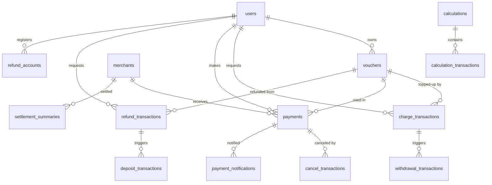
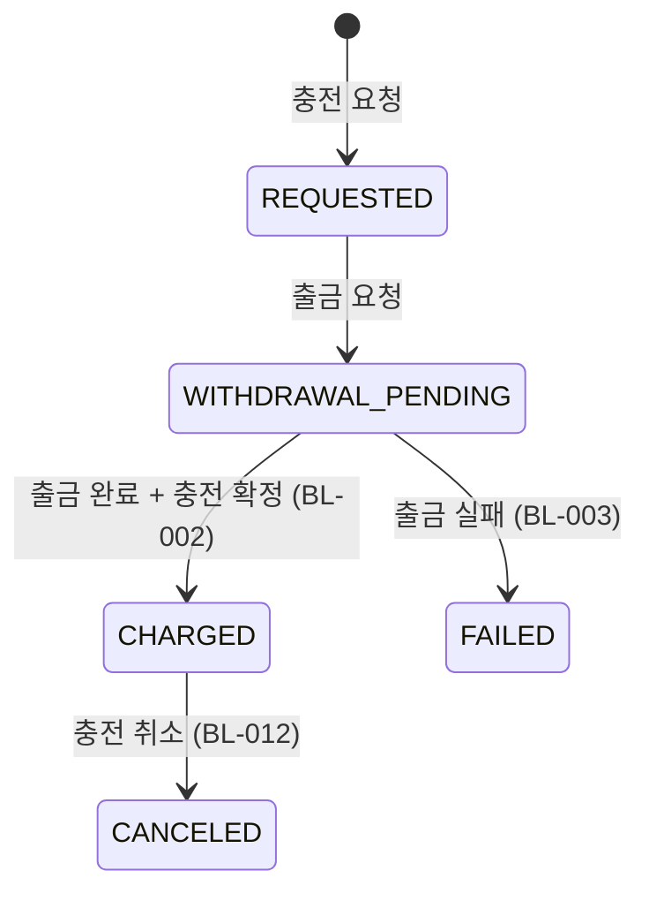
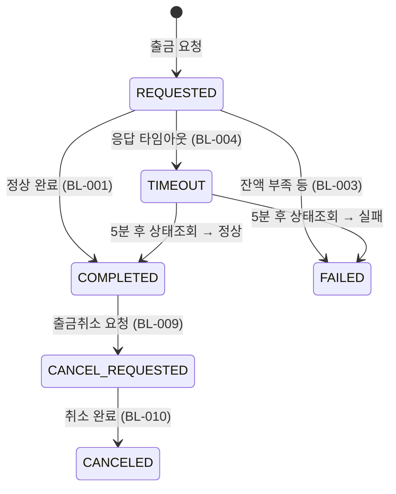
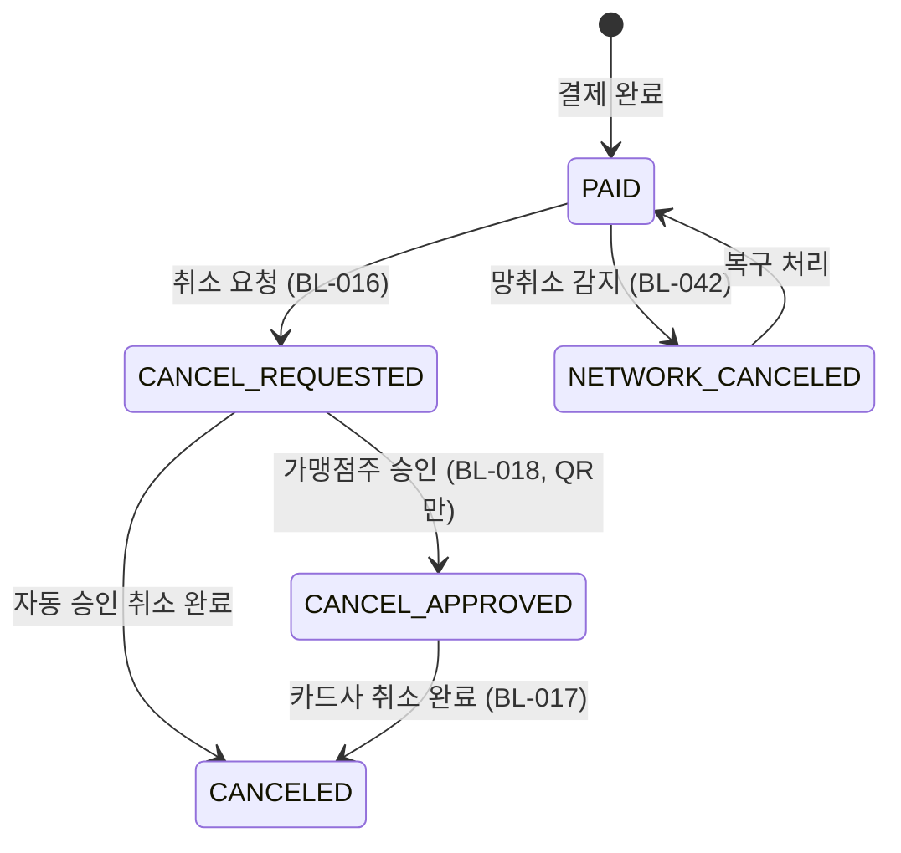
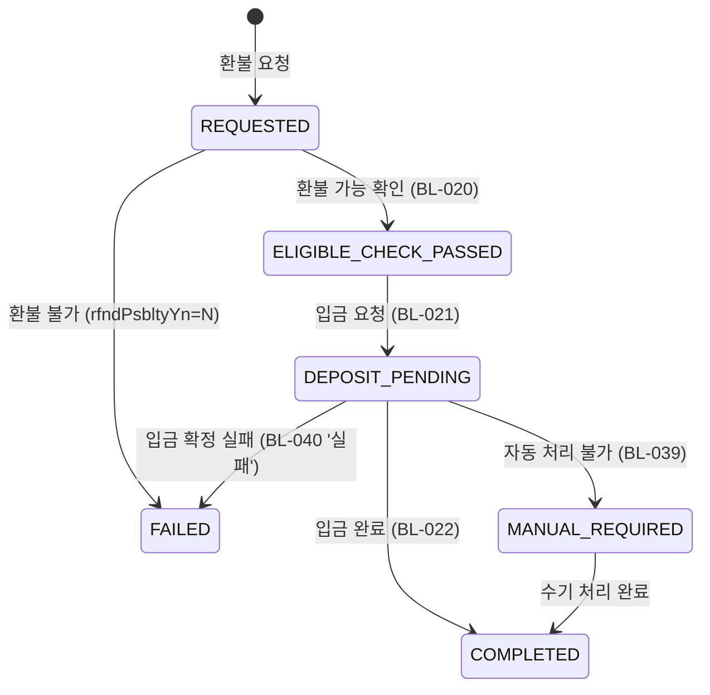

# 데이터 모델 명세 — LPON 온누리상품권

## 도메인: 온누리상품권 (LPON)
## 핵심 엔티티: 사용자, 상품권, 결제, 환불, 가맹점, 정산, 알림

> **출처**: AI Foundry 역공학 추출물 (db-ontology terms + 01-business-logic.md BL 참조)
> **DB 호환**: SQLite (Cloudflare D1 호환 — TEXT, INTEGER, REAL)
> **테이블 수**: 14개 (핵심 8 + 보조 6)

---

## ERD



---

## 테이블 정의

### users (사용자)
-- 관련 비즈니스 룰: BL-001 ~ BL-007, BL-024, BL-025, BL-039

```sql
CREATE TABLE users (
  id TEXT PRIMARY KEY,                                         -- UUID
  name TEXT NOT NULL,                                          -- 사용자명
  phone TEXT NOT NULL,                                         -- 연락처 (SMS 발송용)
  email TEXT,                                                  -- 이메일
  role TEXT NOT NULL CHECK(role IN ('USER','MERCHANT','ADMIN')), -- 역할
  status TEXT NOT NULL CHECK(status IN ('ACTIVE','WITHDRAWN','SUSPENDED')), -- 상태
  sms_opt_in INTEGER NOT NULL DEFAULT 1,                       -- SMS 수신 동의 (1=Y, 0=N)
  card_sms_dedup INTEGER NOT NULL DEFAULT 0,                   -- 카드사 SMS 중복 방지 옵션 (1=Y, 0=N)
  created_at TEXT NOT NULL DEFAULT (datetime('now')),
  updated_at TEXT NOT NULL DEFAULT (datetime('now'))
);
CREATE INDEX idx_users_phone ON users(phone);
CREATE INDEX idx_users_status ON users(status);
```

---

### vouchers (상품권)
-- 관련 비즈니스 룰: BL-005, BL-014, BL-024, BL-025, BL-029, BL-030

```sql
CREATE TABLE vouchers (
  id TEXT PRIMARY KEY,                                         -- UUID
  user_id TEXT NOT NULL,                                       -- 소유자
  face_amount INTEGER NOT NULL,                                -- 액면가 (원)
  balance INTEGER NOT NULL,                                    -- 잔액 (원)
  status TEXT NOT NULL CHECK(status IN ('ACTIVE','USED','EXPIRED','REFUNDED')), -- 상태
  purchased_at TEXT NOT NULL,                                  -- 구매 일시
  expires_at TEXT NOT NULL,                                    -- 유효기간 만료 일시
  created_at TEXT NOT NULL DEFAULT (datetime('now')),
  updated_at TEXT NOT NULL DEFAULT (datetime('now')),
  FOREIGN KEY (user_id) REFERENCES users(id)
);
CREATE INDEX idx_vouchers_user ON vouchers(user_id);
CREATE INDEX idx_vouchers_status ON vouchers(status);
CREATE INDEX idx_vouchers_expires ON vouchers(expires_at);
```

---

### charge_transactions (충전 거래)
-- 관련 비즈니스 룰: BL-001 ~ BL-008, BL-009 ~ BL-013

```sql
CREATE TABLE charge_transactions (
  id TEXT PRIMARY KEY,                                         -- UUID
  user_id TEXT NOT NULL,                                       -- 충전 요청자
  voucher_id TEXT NOT NULL,                                    -- 충전 대상 상품권
  amount INTEGER NOT NULL,                                     -- 충전 금액 (원)
  charge_type TEXT NOT NULL CHECK(charge_type IN ('MANUAL','AUTO','COMPANY','POINT')), -- 충전 유형
  status TEXT NOT NULL CHECK(status IN ('REQUESTED','WITHDRAWAL_PENDING','CHARGED','CANCELED','FAILED')), -- 상태
  discount_amount INTEGER NOT NULL DEFAULT 0,                  -- 할인 금액 (원)
  company_id TEXT,                                             -- 회사 충전 시 회사 ID
  created_at TEXT NOT NULL DEFAULT (datetime('now')),
  updated_at TEXT NOT NULL DEFAULT (datetime('now')),
  FOREIGN KEY (user_id) REFERENCES users(id),
  FOREIGN KEY (voucher_id) REFERENCES vouchers(id)
);
CREATE INDEX idx_charge_tx_user ON charge_transactions(user_id);
CREATE INDEX idx_charge_tx_voucher ON charge_transactions(voucher_id);
CREATE INDEX idx_charge_tx_status ON charge_transactions(status);
CREATE INDEX idx_charge_tx_created ON charge_transactions(created_at);
```

---

### withdrawal_transactions (출금 거래)
-- 관련 비즈니스 룰: BL-001 ~ BL-004, BL-009, BL-010, BL-037, BL-038

```sql
CREATE TABLE withdrawal_transactions (
  id TEXT PRIMARY KEY,                                         -- UUID
  charge_transaction_id TEXT NOT NULL,                         -- 연관 충전 거래
  account_number TEXT NOT NULL,                                -- 출금 계좌번호 (마스킹 저장)
  bank_code TEXT NOT NULL,                                     -- 은행 코드
  amount INTEGER NOT NULL,                                     -- 출금 금액 (원)
  status TEXT NOT NULL CHECK(status IN ('REQUESTED','COMPLETED','FAILED','TIMEOUT','CANCEL_REQUESTED','CANCELED')),
  external_tx_id TEXT,                                         -- 머니플랫폼 거래 ID
  timeout_check_at TEXT,                                       -- 타임아웃 상태조회 예정 시각
  error_code TEXT,                                             -- 외부 API 에러 코드
  error_message TEXT,                                          -- 에러 메시지
  created_at TEXT NOT NULL DEFAULT (datetime('now')),
  updated_at TEXT NOT NULL DEFAULT (datetime('now')),
  FOREIGN KEY (charge_transaction_id) REFERENCES charge_transactions(id)
);
CREATE INDEX idx_withdrawal_tx_charge ON withdrawal_transactions(charge_transaction_id);
CREATE INDEX idx_withdrawal_tx_status ON withdrawal_transactions(status);
```

---

### merchants (가맹점)
-- 관련 비즈니스 룰: BL-017, BL-018

```sql
CREATE TABLE merchants (
  id TEXT PRIMARY KEY,                                         -- UUID
  name TEXT NOT NULL,                                          -- 가맹점명
  business_number TEXT NOT NULL UNIQUE,                        -- 사업자등록번호
  owner_user_id TEXT NOT NULL,                                 -- 가맹점주 사용자 ID
  mpm_merchant_id TEXT,                                        -- BC카드 MPM 가맹점 ID
  status TEXT NOT NULL CHECK(status IN ('ACTIVE','SUSPENDED','TERMINATED')),
  created_at TEXT NOT NULL DEFAULT (datetime('now')),
  updated_at TEXT NOT NULL DEFAULT (datetime('now')),
  FOREIGN KEY (owner_user_id) REFERENCES users(id)
);
CREATE INDEX idx_merchants_owner ON merchants(owner_user_id);
CREATE INDEX idx_merchants_status ON merchants(status);
```

---

### payments (결제)
-- 관련 비즈니스 룰: BL-014 ~ BL-018, BL-042

```sql
CREATE TABLE payments (
  id TEXT PRIMARY KEY,                                         -- UUID
  user_id TEXT NOT NULL,                                       -- 결제자
  merchant_id TEXT NOT NULL,                                   -- 결제 가맹점
  voucher_id TEXT NOT NULL,                                    -- 사용 상품권
  amount INTEGER NOT NULL,                                     -- 결제 금액 (원)
  method TEXT NOT NULL CHECK(method IN ('QR','CARD','ONLINE')), -- 결제 수단
  status TEXT NOT NULL CHECK(status IN ('PAID','CANCEL_REQUESTED','CANCEL_APPROVED','CANCELED','NETWORK_CANCELED')),
  paid_at TEXT NOT NULL,                                       -- 결제 완료 일시
  canceled_at TEXT,                                            -- 취소 완료 일시
  idempotency_key TEXT UNIQUE,                                 -- 멱등성 키 (망취소 복구용)
  created_at TEXT NOT NULL DEFAULT (datetime('now')),
  updated_at TEXT NOT NULL DEFAULT (datetime('now')),
  FOREIGN KEY (user_id) REFERENCES users(id),
  FOREIGN KEY (merchant_id) REFERENCES merchants(id),
  FOREIGN KEY (voucher_id) REFERENCES vouchers(id)
);
CREATE INDEX idx_payments_user ON payments(user_id);
CREATE INDEX idx_payments_merchant ON payments(merchant_id);
CREATE INDEX idx_payments_status ON payments(status);
CREATE INDEX idx_payments_paid ON payments(paid_at);
```

---

### cancel_transactions (결제 취소)
-- 관련 비즈니스 룰: BL-016 ~ BL-019, BL-042

```sql
CREATE TABLE cancel_transactions (
  id TEXT PRIMARY KEY,                                         -- UUID
  payment_id TEXT NOT NULL,                                    -- 원 결제 ID
  cancel_type TEXT NOT NULL CHECK(cancel_type IN ('FULL','PARTIAL','NETWORK')), -- 취소 유형
  cancel_amount INTEGER NOT NULL,                              -- 취소 금액 (원)
  requester_type TEXT NOT NULL CHECK(requester_type IN ('USER','MERCHANT','SYSTEM','ADMIN')),
  status TEXT NOT NULL CHECK(status IN ('REQUESTED','MERCHANT_APPROVAL_PENDING','APPROVED','COMPLETED','FAILED')),
  merchant_approved_at TEXT,                                   -- 가맹점주 승인 일시 (QR 취소)
  external_cancel_id TEXT,                                     -- 카드사/MPM 취소 전문 ID
  reason TEXT,                                                 -- 취소 사유
  created_at TEXT NOT NULL DEFAULT (datetime('now')),
  updated_at TEXT NOT NULL DEFAULT (datetime('now')),
  FOREIGN KEY (payment_id) REFERENCES payments(id)
);
CREATE INDEX idx_cancel_tx_payment ON cancel_transactions(payment_id);
CREATE INDEX idx_cancel_tx_status ON cancel_transactions(status);
```

---

### refund_transactions (환불)
-- 관련 비즈니스 룰: BL-020 ~ BL-030, BL-039, BL-040

```sql
CREATE TABLE refund_transactions (
  id TEXT PRIMARY KEY,                                         -- UUID
  user_id TEXT NOT NULL,                                       -- 환불 요청자
  voucher_id TEXT NOT NULL,                                    -- 환불 대상 상품권
  refund_type TEXT NOT NULL CHECK(refund_type IN ('UNUSED_FULL','USED_BALANCE','CHARGE_CANCEL','FORCED')),
  requested_amount INTEGER NOT NULL,                           -- 환불 요청 금액 (원)
  exclusion_amount INTEGER NOT NULL DEFAULT 0,                 -- 제외 금액 (원) — 캐시백, 할인보전 등
  deposit_amount INTEGER NOT NULL,                             -- 입금 금액 (원) = requested - exclusion
  status TEXT NOT NULL CHECK(status IN ('REQUESTED','ELIGIBLE_CHECK_PASSED','DEPOSIT_PENDING','COMPLETED','FAILED','MANUAL_REQUIRED')),
  rfnd_psblty_yn TEXT NOT NULL DEFAULT 'N' CHECK(rfnd_psblty_yn IN ('Y','N')), -- 환불 가능 여부
  is_manual INTEGER NOT NULL DEFAULT 0,                        -- 수기 처리 여부 (1=Y, 0=N)
  processed_by TEXT,                                           -- 수기처리 시 관리자 ID
  error_code TEXT,                                             -- 에러 코드
  error_message TEXT,                                          -- 에러 메시지
  created_at TEXT NOT NULL DEFAULT (datetime('now')),
  updated_at TEXT NOT NULL DEFAULT (datetime('now')),
  FOREIGN KEY (user_id) REFERENCES users(id),
  FOREIGN KEY (voucher_id) REFERENCES vouchers(id)
);
CREATE INDEX idx_refund_tx_user ON refund_transactions(user_id);
CREATE INDEX idx_refund_tx_voucher ON refund_transactions(voucher_id);
CREATE INDEX idx_refund_tx_status ON refund_transactions(status);
```

---

### deposit_transactions (입금 — 환불 시 사용자 계좌 입금)
-- 관련 비즈니스 룰: BL-021 ~ BL-023, BL-040

```sql
CREATE TABLE deposit_transactions (
  id TEXT PRIMARY KEY,                                         -- UUID
  refund_transaction_id TEXT NOT NULL,                         -- 연관 환불 거래
  refund_account_id TEXT NOT NULL,                             -- 입금 대상 계좌
  amount INTEGER NOT NULL,                                     -- 입금 금액 (원)
  status TEXT NOT NULL CHECK(status IN ('REQUESTED','COMPLETED','ERROR','FAILED','TIMEOUT')),
  same_day_deposit INTEGER NOT NULL DEFAULT 0,                 -- 당일 입금 여부 (1=Y, 0=N)
  external_tx_id TEXT,                                         -- 외부 입금 거래 ID
  retry_count INTEGER NOT NULL DEFAULT 0,                      -- 재시도 횟수
  error_code TEXT,
  error_message TEXT,
  created_at TEXT NOT NULL DEFAULT (datetime('now')),
  updated_at TEXT NOT NULL DEFAULT (datetime('now')),
  FOREIGN KEY (refund_transaction_id) REFERENCES refund_transactions(id),
  FOREIGN KEY (refund_account_id) REFERENCES refund_accounts(id)
);
CREATE INDEX idx_deposit_tx_refund ON deposit_transactions(refund_transaction_id);
CREATE INDEX idx_deposit_tx_status ON deposit_transactions(status);
```

---

### refund_accounts (환불 계좌)
-- 관련 비즈니스 룰: BL-027

```sql
CREATE TABLE refund_accounts (
  id TEXT PRIMARY KEY,                                         -- UUID
  user_id TEXT NOT NULL,                                       -- 계좌 소유자
  bank_code TEXT NOT NULL,                                     -- 은행 코드
  account_number TEXT NOT NULL,                                -- 계좌번호 (마스킹 저장)
  holder_name TEXT NOT NULL,                                   -- 예금주명
  is_verified INTEGER NOT NULL DEFAULT 0,                      -- 검증 여부 (1=Y, 0=N)
  created_at TEXT NOT NULL DEFAULT (datetime('now')),
  updated_at TEXT NOT NULL DEFAULT (datetime('now')),
  FOREIGN KEY (user_id) REFERENCES users(id)
);
CREATE INDEX idx_refund_accounts_user ON refund_accounts(user_id);
```

---

### auto_charge_settings (자동충전 설정)
-- 관련 비즈니스 룰: BL-008

```sql
CREATE TABLE auto_charge_settings (
  id TEXT PRIMARY KEY,                                         -- UUID
  user_id TEXT NOT NULL,                                       -- 설정 대상 사용자
  voucher_id TEXT NOT NULL,                                    -- 대상 상품권
  is_enabled INTEGER NOT NULL DEFAULT 1,                       -- 활성화 여부 (1=Y, 0=N)
  setting_amount INTEGER NOT NULL,                             -- 설정 금액 (stngAmt, 원)
  balance_condition_amount INTEGER,                            -- 잔액 조건 금액 (blceCondAmt, 원)
  date_condition_amount INTEGER,                               -- 일자 조건 금액 (ymdCondAmt, 원)
  compound_condition_amount INTEGER,                           -- 복합 조건 금액 (condSmAmt, 원)
  created_at TEXT NOT NULL DEFAULT (datetime('now')),
  updated_at TEXT NOT NULL DEFAULT (datetime('now')),
  FOREIGN KEY (user_id) REFERENCES users(id),
  FOREIGN KEY (voucher_id) REFERENCES vouchers(id)
);
CREATE INDEX idx_auto_charge_user ON auto_charge_settings(user_id);
```

---

### point_transactions (포인트 충전/환불)
-- 관련 비즈니스 룰: BL-007, BL-032

```sql
CREATE TABLE point_transactions (
  id TEXT PRIMARY KEY,                                         -- UUID
  user_id TEXT NOT NULL,                                       -- 사용자
  voucher_id TEXT NOT NULL,                                    -- 대상 상품권
  tx_type TEXT NOT NULL CHECK(tx_type IN ('CHARGE','REFUND')), -- 거래 유형
  amount INTEGER NOT NULL,                                     -- 금액 (원)
  status TEXT NOT NULL CHECK(status IN ('REQUESTED','COMPLETED','FAILED')),
  created_at TEXT NOT NULL DEFAULT (datetime('now')),
  updated_at TEXT NOT NULL DEFAULT (datetime('now')),
  FOREIGN KEY (user_id) REFERENCES users(id),
  FOREIGN KEY (voucher_id) REFERENCES vouchers(id)
);
CREATE INDEX idx_point_tx_user ON point_transactions(user_id);
CREATE INDEX idx_point_tx_type ON point_transactions(tx_type);
```

---

### calculations (정산)
-- 관련 비즈니스 룰: BL-033 ~ BL-036

```sql
CREATE TABLE calculations (
  id TEXT PRIMARY KEY,                                         -- UUID
  merchant_id TEXT NOT NULL,                                   -- 정산 대상 가맹점
  period_start TEXT NOT NULL,                                  -- 정산 시작일 (YYYY-MM-DD)
  period_end TEXT NOT NULL,                                    -- 정산 종료일 (YYYY-MM-DD)
  total_charge_count INTEGER NOT NULL DEFAULT 0,               -- 충전 건수
  total_charge_amount INTEGER NOT NULL DEFAULT 0,              -- 충전 금액 (원)
  total_discount_amount INTEGER NOT NULL DEFAULT 0,            -- 할인 금액 (원)
  total_refund_count INTEGER NOT NULL DEFAULT 0,               -- 환불 건수
  total_refund_amount INTEGER NOT NULL DEFAULT 0,              -- 환불 금액 (원)
  total_refund_fee INTEGER NOT NULL DEFAULT 0,                 -- 환불 수수료 (원)
  settlement_fee_yn TEXT NOT NULL DEFAULT 'N' CHECK(settlement_fee_yn IN ('Y','N')), -- 정산수수료 반영 여부
  settlement_fee_amount INTEGER NOT NULL DEFAULT 0,            -- 정산 수수료 (원)
  status TEXT NOT NULL CHECK(status IN ('PENDING','CALCULATING','COMPLETED','VERIFIED')),
  batch_id TEXT,                                               -- 배치 실행 ID
  created_at TEXT NOT NULL DEFAULT (datetime('now')),
  updated_at TEXT NOT NULL DEFAULT (datetime('now')),
  FOREIGN KEY (merchant_id) REFERENCES merchants(id)
);
CREATE INDEX idx_calc_merchant ON calculations(merchant_id);
CREATE INDEX idx_calc_period ON calculations(period_start, period_end);
CREATE INDEX idx_calc_status ON calculations(status);
```

---

### calculation_transactions (정산 거래 상세)
-- 관련 비즈니스 룰: BL-033, BL-034

```sql
CREATE TABLE calculation_transactions (
  id TEXT PRIMARY KEY,                                         -- UUID
  calculation_id TEXT NOT NULL,                                -- 정산 ID
  source_type TEXT NOT NULL CHECK(source_type IN ('CHARGE','REFUND','PAYMENT','CANCEL','POINT')),
  source_id TEXT NOT NULL,                                     -- 원 거래 ID
  amount INTEGER NOT NULL,                                     -- 금액 (원)
  fee_amount INTEGER NOT NULL DEFAULT 0,                       -- 수수료 (원)
  processed INTEGER NOT NULL DEFAULT 0,                        -- 처리 완료 여부 (1=Y, 0=N)
  created_at TEXT NOT NULL DEFAULT (datetime('now')),
  updated_at TEXT NOT NULL DEFAULT (datetime('now')),
  FOREIGN KEY (calculation_id) REFERENCES calculations(id)
);
CREATE INDEX idx_calc_tx_calc ON calculation_transactions(calculation_id);
CREATE INDEX idx_calc_tx_source ON calculation_transactions(source_type, source_id);
```

---

### settlement_summaries (정산 요약 — 집계용)
-- 관련 비즈니스 룰: BL-031, BL-032

```sql
CREATE TABLE settlement_summaries (
  id TEXT PRIMARY KEY,                                         -- UUID
  merchant_id TEXT NOT NULL,                                   -- 가맹점
  summary_date TEXT NOT NULL,                                  -- 집계 기준일 (YYYY-MM-DD)
  charge_count INTEGER NOT NULL DEFAULT 0,
  charge_amount INTEGER NOT NULL DEFAULT 0,
  charge_discount_amount INTEGER NOT NULL DEFAULT 0,
  refund_count INTEGER NOT NULL DEFAULT 0,
  refund_amount INTEGER NOT NULL DEFAULT 0,
  refund_fee INTEGER NOT NULL DEFAULT 0,
  point_charge_count INTEGER NOT NULL DEFAULT 0,
  point_charge_amount INTEGER NOT NULL DEFAULT 0,
  point_refund_count INTEGER NOT NULL DEFAULT 0,
  point_refund_amount INTEGER NOT NULL DEFAULT 0,
  created_at TEXT NOT NULL DEFAULT (datetime('now')),
  updated_at TEXT NOT NULL DEFAULT (datetime('now')),
  FOREIGN KEY (merchant_id) REFERENCES merchants(id),
  UNIQUE(merchant_id, summary_date)
);
CREATE INDEX idx_settlement_date ON settlement_summaries(summary_date);
```

---

### payment_notifications (결제 알림)
-- 관련 비즈니스 룰: BL-015, BL-043, BL-044

```sql
CREATE TABLE payment_notifications (
  id TEXT PRIMARY KEY,                                         -- UUID
  payment_id TEXT NOT NULL,                                    -- 결제 ID
  recipient_type TEXT NOT NULL CHECK(recipient_type IN ('USER','MERCHANT')),
  recipient_id TEXT NOT NULL,                                  -- 수신자 ID
  channel TEXT NOT NULL CHECK(channel IN ('SMS','LMS','PUSH','IN_APP')), -- 알림 채널
  status TEXT NOT NULL CHECK(status IN ('PENDING','SENT','FAILED','SKIPPED')),
  skipped_reason TEXT,                                         -- SKIPPED 사유 (예: 카드사 SMS 중복방지)
  sent_at TEXT,
  created_at TEXT NOT NULL DEFAULT (datetime('now')),
  FOREIGN KEY (payment_id) REFERENCES payments(id)
);
CREATE INDEX idx_notif_payment ON payment_notifications(payment_id);
CREATE INDEX idx_notif_recipient ON payment_notifications(recipient_type, recipient_id);
```

---

### scheduled_messages (스케줄 메시지)
-- 관련 비즈니스 룰: BL-045 ~ BL-047

```sql
CREATE TABLE scheduled_messages (
  id TEXT PRIMARY KEY,                                         -- UUID
  message_type TEXT NOT NULL CHECK(message_type IN ('POLICY_PUBLISH','NOTICE','PROMOTION')),
  recipient_id TEXT NOT NULL,                                  -- 수신자 ID
  channel TEXT NOT NULL CHECK(channel IN ('SMS','LMS','PUSH')),
  content TEXT NOT NULL,                                       -- 메시지 내용
  scheduled_at TEXT NOT NULL,                                  -- 발송 예정 일시
  status TEXT NOT NULL CHECK(status IN ('SCHEDULED','SENT','CANCELED','FAILED')),
  canceled_at TEXT,                                            -- 취소 일시
  sent_at TEXT,                                                -- 실제 발송 일시
  created_at TEXT NOT NULL DEFAULT (datetime('now')),
  updated_at TEXT NOT NULL DEFAULT (datetime('now'))
);
CREATE INDEX idx_sched_msg_status ON scheduled_messages(status);
CREATE INDEX idx_sched_msg_scheduled ON scheduled_messages(scheduled_at);
```

---

## Enum 정의

| Enum | 값 | 비즈니스 의미 | 사용 테이블 |
|------|-----|-------------|-----------|
| `user_role` | USER, MERCHANT, ADMIN | 사용자 역할 | `users` |
| `user_status` | ACTIVE, WITHDRAWN, SUSPENDED | 사용자 상태 (BL-019: 탈퇴 후 취소 처리) | `users` |
| `voucher_status` | ACTIVE, USED, EXPIRED, REFUNDED | 상품권 상태 (BL-029: 만료 상품권 환불 불가) | `vouchers` |
| `charge_type` | MANUAL, AUTO, COMPANY, POINT | 충전 유형 (BL-005~008) | `charge_transactions` |
| `charge_status` | REQUESTED, WITHDRAWAL_PENDING, CHARGED, CANCELED, FAILED | 충전 상태 전이 | `charge_transactions` |
| `withdrawal_status` | REQUESTED, COMPLETED, FAILED, TIMEOUT, CANCEL_REQUESTED, CANCELED | 출금 상태 (BL-004: 타임아웃→상태조회) | `withdrawal_transactions` |
| `payment_method` | QR, CARD, ONLINE | 결제 수단 (BL-017: QR→가맹점주 승인) | `payments` |
| `payment_status` | PAID, CANCEL_REQUESTED, CANCEL_APPROVED, CANCELED, NETWORK_CANCELED | 결제 상태 (BL-042: 망취소) | `payments` |
| `cancel_type` | FULL, PARTIAL, NETWORK | 취소 유형 (BL-014: 부분취소, 망취소) | `cancel_transactions` |
| `cancel_requester` | USER, MERCHANT, SYSTEM, ADMIN | 취소 요청자 | `cancel_transactions` |
| `cancel_status` | REQUESTED, MERCHANT_APPROVAL_PENDING, APPROVED, COMPLETED, FAILED | 취소 상태 (BL-018: 가맹점주 승인) | `cancel_transactions` |
| `refund_type` | UNUSED_FULL, USED_BALANCE, CHARGE_CANCEL, FORCED | 환불 유형 (BL-024~029) | `refund_transactions` |
| `refund_status` | REQUESTED, ELIGIBLE_CHECK_PASSED, DEPOSIT_PENDING, COMPLETED, FAILED, MANUAL_REQUIRED | 환불 상태 (BL-039: 수기처리) | `refund_transactions` |
| `deposit_status` | REQUESTED, COMPLETED, ERROR, FAILED, TIMEOUT | 입금 상태 (BL-040: 에러 vs 실패 차등) | `deposit_transactions` |
| `point_tx_type` | CHARGE, REFUND | 포인트 거래 유형 | `point_transactions` |
| `calc_status` | PENDING, CALCULATING, COMPLETED, VERIFIED | 정산 상태 | `calculations` |
| `calc_source_type` | CHARGE, REFUND, PAYMENT, CANCEL, POINT | 정산 거래 출처 | `calculation_transactions` |
| `notif_channel` | SMS, LMS, PUSH, IN_APP | 알림 채널 | `payment_notifications`, `scheduled_messages` |
| `notif_status` | PENDING, SENT, FAILED, SKIPPED | 알림 상태 (BL-044: 중복방지 SKIPPED) | `payment_notifications` |
| `sched_msg_status` | SCHEDULED, SENT, CANCELED, FAILED | 스케줄 메시지 상태 (BL-046~047) | `scheduled_messages` |

---

## 상태 전이 다이어그램

### 충전 거래 상태 (charge_transactions.status)


### 출금 거래 상태 (withdrawal_transactions.status)


### 결제 상태 (payments.status)


### 환불 상태 (refund_transactions.status)


---

## 테이블-BL 참조 매트릭스

| 테이블 | 관련 BL (주요) |
|--------|--------------|
| `users` | BL-019 (탈퇴), BL-039 (수기처리 관리자) |
| `vouchers` | BL-005, BL-024 (7일 환불), BL-025 (60% 잔액 환불), BL-029 (만료), BL-030 (연장 불가) |
| `charge_transactions` | BL-001~008, BL-009~013, BL-031 |
| `withdrawal_transactions` | BL-001~004, BL-009~010, BL-037~038 |
| `merchants` | BL-017 (MPM 취소), BL-018 (QR 승인) |
| `payments` | BL-014~018, BL-042 (망취소) |
| `cancel_transactions` | BL-016~019 |
| `refund_transactions` | BL-020~030, BL-039~040 |
| `deposit_transactions` | BL-021~023, BL-040 |
| `refund_accounts` | BL-027 (계좌 오류 재등록) |
| `auto_charge_settings` | BL-008 (자동충전) |
| `point_transactions` | BL-007, BL-032 |
| `calculations` | BL-033~036 |
| `calculation_transactions` | BL-033, BL-034 |
| `settlement_summaries` | BL-031, BL-032 |
| `payment_notifications` | BL-015 (5만원 SMS), BL-043, BL-044 |
| `scheduled_messages` | BL-045~047 |
