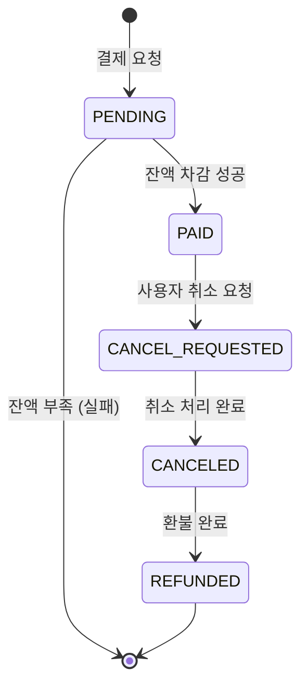
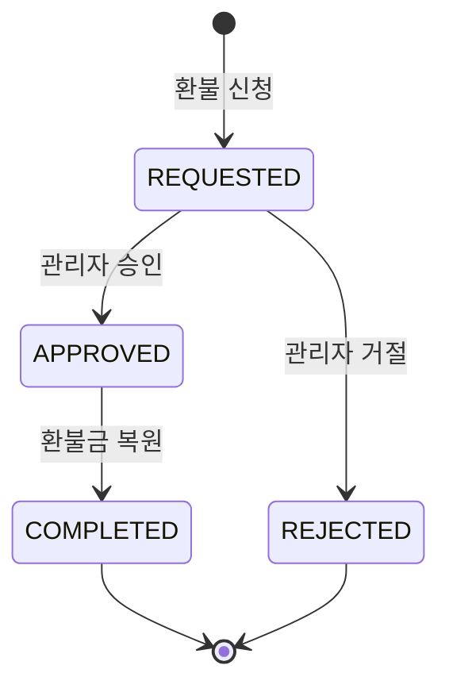
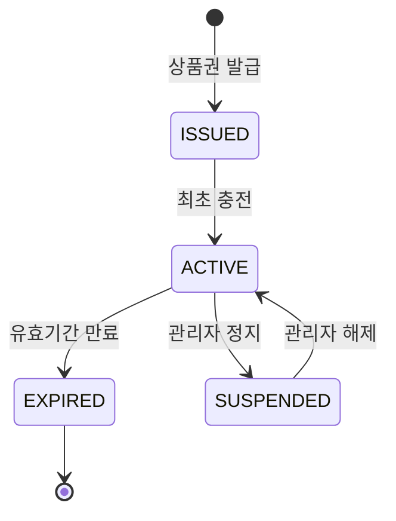
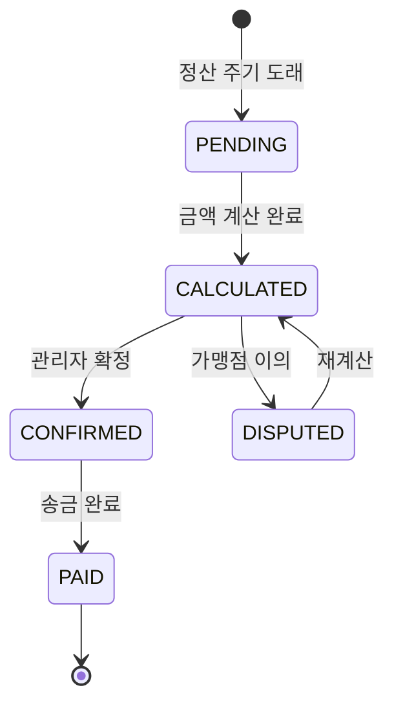
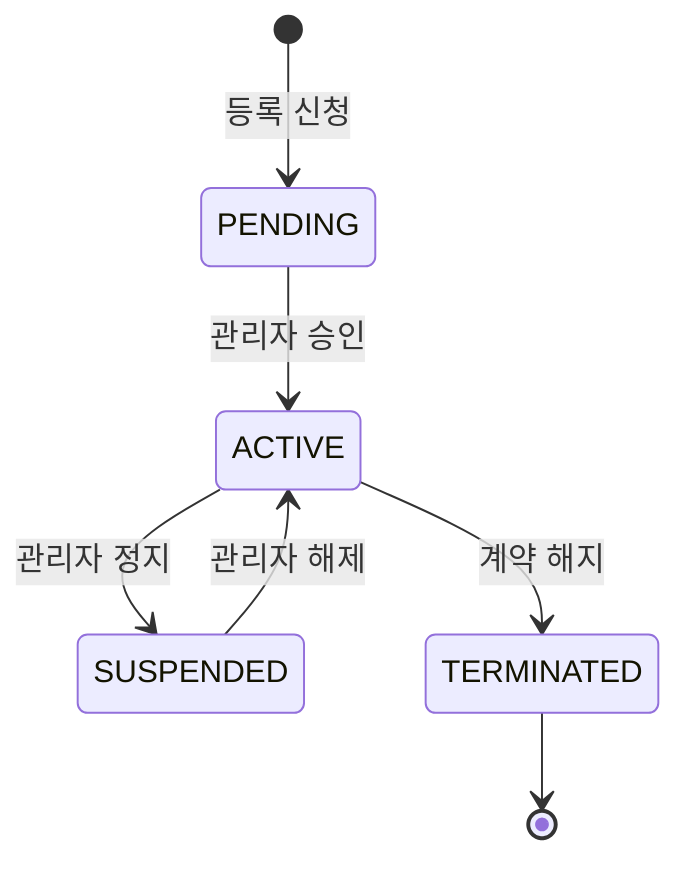

# 화면 정의 — LPON 온누리상품권

> **도메인**: 온누리상품권 (LPON)
> **범위**: 이용자 / 가맹점 / 관리자 주요 화면
> **수준**: 와이어프레임 + 상태 전이 (후순위 문서)
> **버전**: 1.0
> **작성일**: 2026-03-19

---

## 1. 화면 구성 개요

### 1.1 역할별 화면 분류

| 역할 | 화면 그룹 | 주요 화면 수 |
|------|----------|:----------:|
| USER (이용자) | 상품권, 충전, 결제, 환불, 알림 | 8 |
| MERCHANT (가맹점) | 가맹점 정보, 결제 내역, 정산, 알림 | 5 |
| ADMIN (관리자) | 대시보드, 가맹점 관리, 정산 관리, 환불 관리 | 5 |
| **합계** | | **18** |

---

## 2. 이용자 화면 (USER)

### 2.1 SCR-001: 메인 (상품권 대시보드)

```
┌─────────────────────────────────────────┐
│  LPON 온누리상품권                [알림🔔] │
├─────────────────────────────────────────┤
│                                         │
│  ┌─────────────────────────────────┐    │
│  │  내 상품권                       │    │
│  │  ┌────────────────────────┐     │    │
│  │  │  잔액: ₩125,000        │     │    │
│  │  │  유형: 모바일            │     │    │
│  │  │  유효기간: 2027-03-19   │     │    │
│  │  └────────────────────────┘     │    │
│  │  [충전하기]      [결제하기]       │    │
│  └─────────────────────────────────┘    │
│                                         │
│  최근 거래                               │
│  ┌─────────────────────────────────┐    │
│  │  03-19  결제  -₩15,000  맛있는식당│    │
│  │  03-18  충전  +₩50,000  카드     │    │
│  │  03-17  환불  +₩3,000   반품     │    │
│  └─────────────────────────────────┘    │
│  [전체 내역 보기]                        │
│                                         │
├─────────────────────────────────────────┤
│  [홈]  [충전]  [결제]  [내역]  [더보기]    │
└─────────────────────────────────────────┘
```

- **진입점**: 로그인 후 기본 화면
- **데이터**: API-004 (상품권 상세), API-022 (결제 목록, 최근 5건)

---

### 2.2 SCR-002: 충전 화면

```
┌─────────────────────────────────────────┐
│  ← 충전하기                              │
├─────────────────────────────────────────┤
│                                         │
│  현재 잔액: ₩125,000                     │
│                                         │
│  충전 금액 선택                           │
│  ┌────┐ ┌────┐ ┌────┐ ┌────┐          │
│  │ 1만│ │ 3만│ │ 5만│ │10만│          │
│  └────┘ └────┘ └────┘ └────┘          │
│  ┌────┐ ┌────┐ ┌────────────┐         │
│  │20만│ │30만│ │ 직접 입력 ▼ │         │
│  └────┘ └────┘ └────────────┘         │
│                                         │
│  결제 수단                               │
│  ○ 신용/체크카드                         │
│  ○ 계좌이체                             │
│                                         │
│  ┌─────────────────────────────────┐    │
│  │  충전 한도 안내                    │    │
│  │  일 한도: ₩1,000,000             │    │
│  │  월 한도: ₩3,000,000             │    │
│  │  오늘 충전: ₩50,000              │    │
│  └─────────────────────────────────┘    │
│                                         │
│  ┌─────────────────────────────────┐    │
│  │         [충전하기]                │    │
│  └─────────────────────────────────┘    │
└─────────────────────────────────────────┘
```

- **금액 단위**: 1,000원 단위, 최소 1,000원 ~ 최대 500,000원
- **API**: API-010 (충전 실행)

---

### 2.3 SCR-003: 결제 화면

```
┌─────────────────────────────────────────┐
│  ← 결제하기                              │
├─────────────────────────────────────────┤
│                                         │
│  현재 잔액: ₩125,000                     │
│                                         │
│  가맹점 검색                             │
│  ┌─────────────────────────────────┐    │
│  │  🔍 가맹점명 검색...              │    │
│  └─────────────────────────────────┘    │
│                                         │
│  선택된 가맹점                           │
│  ┌─────────────────────────────────┐    │
│  │  맛있는식당 (한식)                │    │
│  │  서울 강남구 역삼동 123-4         │    │
│  └─────────────────────────────────┘    │
│                                         │
│  결제 금액                               │
│  ┌─────────────────────────────────┐    │
│  │  ₩ [         15,000           ] │    │
│  └─────────────────────────────────┘    │
│                                         │
│  결제 설명 (선택)                        │
│  ┌─────────────────────────────────┐    │
│  │  [    점심 식사                 ] │    │
│  └─────────────────────────────────┘    │
│                                         │
│  결제 후 잔액: ₩110,000                  │
│                                         │
│  ┌─────────────────────────────────┐    │
│  │         [결제하기]                │    │
│  └─────────────────────────────────┘    │
└─────────────────────────────────────────┘
```

- **가맹점 검색**: API-042 (가맹점 목록, search 파라미터)
- **결제 실행**: API-020

---

### 2.4 SCR-004: 결제 상세 / 취소

```
┌─────────────────────────────────────────┐
│  ← 결제 상세                             │
├─────────────────────────────────────────┤
│                                         │
│  결제 정보                               │
│  ┌─────────────────────────────────┐    │
│  │  결제 ID: PAY-2026031900001      │    │
│  │  가맹점: 맛있는식당              │    │
│  │  금액: ₩15,000                  │    │
│  │  상태: ✅ 결제 완료              │    │
│  │  결제일: 2026-03-19 12:30       │    │
│  │  설명: 점심 식사                 │    │
│  └─────────────────────────────────┘    │
│                                         │
│  ┌─────────────────────────────────┐    │
│  │  ⚠️ 결제 취소 가능              │    │
│  │  취소 기한: 2026-03-26          │    │
│  └─────────────────────────────────┘    │
│                                         │
│  취소 사유                               │
│  ┌─────────────────────────────────┐    │
│  │  [    단순 변심                 ] │    │
│  └─────────────────────────────────┘    │
│                                         │
│  ┌─────────────────────────────────┐    │
│  │        [결제 취소 요청]           │    │
│  └─────────────────────────────────┘    │
└─────────────────────────────────────────┘
```

- **API**: API-021 (결제 상세), API-023 (결제 취소)
- **취소 기한**: 결제일로부터 7일

---

### 2.5 SCR-005: 환불 신청 / 상태 확인

```
┌─────────────────────────────────────────┐
│  ← 환불 내역                             │
├─────────────────────────────────────────┤
│                                         │
│  환불 목록                               │
│  ┌─────────────────────────────────┐    │
│  │  PAY-001  ₩15,000  🟡 심사중    │    │
│  │  03-19 신청 · 맛있는식당         │    │
│  ├─────────────────────────────────┤    │
│  │  PAY-002  ₩3,000   ✅ 완료      │    │
│  │  03-17 신청 · 편의점            │    │
│  ├─────────────────────────────────┤    │
│  │  PAY-003  ₩8,000   ❌ 거절      │    │
│  │  03-15 신청 · 카페              │    │
│  │  사유: 환불 기간 초과            │    │
│  └─────────────────────────────────┘    │
│                                         │
└─────────────────────────────────────────┘
```

- **API**: API-032 (환불 목록)

---

## 3. 가맹점 화면 (MERCHANT)

### 3.1 SCR-010: 가맹점 대시보드

```
┌─────────────────────────────────────────┐
│  가맹점 관리      맛있는식당    [알림🔔] │
├─────────────────────────────────────────┤
│                                         │
│  ┌──────────┐  ┌──────────┐            │
│  │ 오늘 매출 │  │ 이번달   │            │
│  │ ₩350,000 │  │₩4,200,000│            │
│  └──────────┘  └──────────┘            │
│                                         │
│  ┌──────────────────┐                   │
│  │ 다음 정산 예정     │                   │
│  │ 3/25  ₩3,800,000 │                   │
│  │ (수수료 ₩114,000) │                   │
│  └──────────────────┘                   │
│                                         │
│  최근 결제                               │
│  ┌─────────────────────────────────┐    │
│  │  12:30  ₩15,000  결제완료       │    │
│  │  11:45  ₩22,000  결제완료       │    │
│  │  10:20  ₩8,000   취소요청       │    │
│  └─────────────────────────────────┘    │
│                                         │
├─────────────────────────────────────────┤
│ [대시보드] [결제내역] [정산] [가맹정보]    │
└─────────────────────────────────────────┘
```

- **API**: API-022 (결제 목록), API-050 (정산 목록)

---

### 3.2 SCR-011: 정산 내역

```
┌─────────────────────────────────────────┐
│  ← 정산 내역                             │
├─────────────────────────────────────────┤
│                                         │
│  ┌─────────────────────────────────┐    │
│  │  3월 1주차 (03/01 ~ 03/07)       │    │
│  │  매출: ₩1,200,000               │    │
│  │  환불: -₩30,000                 │    │
│  │  수수료(3%): -₩35,100           │    │
│  │  정산액: ₩1,134,900             │    │
│  │  상태: ✅ 입금완료               │    │
│  ├─────────────────────────────────┤    │
│  │  3월 2주차 (03/08 ~ 03/14)       │    │
│  │  매출: ₩980,000                 │    │
│  │  환불: -₩15,000                 │    │
│  │  수수료(3%): -₩28,950           │    │
│  │  정산액: ₩936,050               │    │
│  │  상태: 🟡 확정대기               │    │
│  └─────────────────────────────────┘    │
│                                         │
└─────────────────────────────────────────┘
```

- **API**: API-050 (정산 목록), API-051 (정산 상세)

---

## 4. 관리자 화면 (ADMIN)

### 4.1 SCR-020: 관리자 대시보드

```
┌─────────────────────────────────────────┐
│  LPON 관리자                             │
├─────────────────────────────────────────┤
│                                         │
│  ┌────────┐ ┌────────┐ ┌────────┐     │
│  │총 이용자│ │총 가맹점│ │활성상품권│     │
│  │ 1,234  │ │  156   │ │   892  │     │
│  └────────┘ └────────┘ └────────┘     │
│                                         │
│  ┌────────┐ ┌────────┐ ┌────────┐     │
│  │오늘 충전│ │오늘 결제│ │미처리환불│     │
│  │₩12.5M │ │₩8.3M  │ │   7건  │     │
│  └────────┘ └────────┘ └────────┘     │
│                                         │
│  대기 중인 작업                          │
│  ┌─────────────────────────────────┐    │
│  │  🔴 환불 승인 대기: 7건          │    │
│  │  🟡 가맹점 승인 대기: 3건        │    │
│  │  🟡 정산 확정 대기: 12건         │    │
│  └─────────────────────────────────┘    │
│                                         │
├─────────────────────────────────────────┤
│ [대시보드] [가맹점] [환불] [정산] [알림]   │
└─────────────────────────────────────────┘
```

---

### 4.2 SCR-021: 환불 관리 (승인/거절)

```
┌─────────────────────────────────────────┐
│  ← 환불 관리                             │
├─────────────────────────────────────────┤
│                                         │
│  필터: [전체 ▼] [심사중 ▼] [날짜 ▼]     │
│                                         │
│  ┌─────────────────────────────────┐    │
│  │  REF-001                         │    │
│  │  결제: PAY-001 (₩15,000)        │    │
│  │  환불 요청: ₩15,000 (전액)       │    │
│  │  사유: 단순 변심                  │    │
│  │  신청일: 2026-03-19              │    │
│  │                                   │    │
│  │  [✅ 승인]        [❌ 거절]       │    │
│  ├─────────────────────────────────┤    │
│  │  REF-002                         │    │
│  │  결제: PAY-005 (₩45,000)        │    │
│  │  환불 요청: ₩20,000 (부분)       │    │
│  │  사유: 상품 불량                  │    │
│  │  신청일: 2026-03-18              │    │
│  │                                   │    │
│  │  [✅ 승인]        [❌ 거절]       │    │
│  └─────────────────────────────────┘    │
│                                         │
└─────────────────────────────────────────┘
```

- **API**: API-032 (환불 목록), API-033 (승인), API-034 (거절)

---

## 5. 사용자 플로우

### 5.1 메인 플로우: 충전 → 결제 → 환불

```
이용자                           시스템                        관리자
  │                              │                             │
  ├─── 상품권 발급 요청 ──────→│                             │
  │←── 상품권 생성 (ISSUED) ────┤                             │
  │                              │                             │
  ├─── 충전 요청 (₩50,000) ──→│                             │
  │    (카드/계좌이체)           │                             │
  │←── 충전 완료 ─────────────┤                             │
  │    (잔액: ₩50,000)         │                             │
  │    (상태: ACTIVE)          │── 알림: 충전 완료 ─────────→│
  │                              │                             │
  ├─── 결제 요청 (₩15,000) ──→│                             │
  │    (가맹점: 맛있는식당)     │                             │
  │←── 결제 완료 (PAID) ──────┤                             │
  │    (잔액: ₩35,000)         │── 정산 대상 추가 ──────────→│
  │                              │── 알림: 결제 완료 ─────────→│
  │                              │                             │
  ├─── 결제 취소 요청 ─────→│                             │
  │←── 상태: CANCEL_REQUESTED ─┤                             │
  │                              │                             │
  ├─── 환불 신청 (₩15,000) ──→│                             │
  │←── 환불 접수 (REQUESTED) ──┤── 알림: 환불 심사 요청 ────→│
  │                              │                             │
  │                              │←── 환불 승인 ────────────┤
  │←── 환불 완료 ─────────────┤                             │
  │    (잔액: ₩50,000 복원)    │── 알림: 환불 완료 ─────────→│
  │                              │── 정산 차감 ──────────────→│
```

### 5.2 가맹점 등록 → 정산 플로우

```
가맹점                           시스템                        관리자
  │                              │                             │
  ├─── 가맹점 등록 신청 ──────→│                             │
  │    (사업자정보, 계좌)        │── 사업자등록 API 검증 ─────→│
  │←── 등록 접수 (PENDING) ────┤── 알림: 가맹점 승인 요청 ──→│
  │                              │                             │
  │                              │←── 가맹점 승인 ───────────┤
  │←── 상태: ACTIVE ───────────┤                             │
  │                              │                             │
  │  ... (결제 발생) ...         │                             │
  │                              │                             │
  │                              │←── 정산 실행 (주간) ──────┤
  │                              │    매출 집계, 수수료 차감   │
  │←── 정산 내역 확인 ─────────┤                             │
  │                              │←── 정산 확정 ────────────┤
  │←── 정산금 입금 ────────────┤── 은행 송금 API ──────────→│
  │                              │── 알림: 정산 완료 ─────────→│
```

---

## 6. 상태 전이 다이어그램

### 6.1 결제 상태 전이



### 6.2 환불 상태 전이



### 6.3 상품권 상태 전이



### 6.4 정산 상태 전이



### 6.5 가맹점 상태 전이



---

## 7. 화면 - API 매핑

| 화면 ID | 화면명 | 역할 | 사용 API |
|---------|--------|------|----------|
| SCR-001 | 메인 (상품권 대시보드) | USER | API-004, API-022 |
| SCR-002 | 충전 | USER | API-010 |
| SCR-003 | 결제 | USER | API-042, API-020 |
| SCR-004 | 결제 상세 / 취소 | USER | API-021, API-023 |
| SCR-005 | 환불 내역 | USER | API-032 |
| SCR-010 | 가맹점 대시보드 | MERCHANT | API-022, API-050 |
| SCR-011 | 정산 내역 | MERCHANT | API-050, API-051 |
| SCR-020 | 관리자 대시보드 | ADMIN | 집계 API |
| SCR-021 | 환불 관리 | ADMIN | API-032, API-033, API-034 |

---

## Version History

| Version | Date | Changes | Author |
|---------|------|---------|--------|
| 1.0 | 2026-03-19 | 초안 — 와이어프레임 9개, 사용자 플로우 2개, 상태 전이 5개 | AI Foundry |
