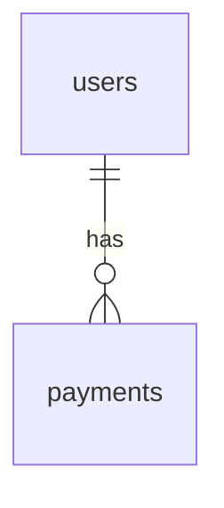

# 반제품 스펙 PRD

**버전:** v2
<!-- CHANGED: 결함 및 개선 피드백 반영, 버전 +1 -->
**날짜:** 2026-03-19
**작성자:** AX BD팀
**상태:** 🔄 검토 중

---

## 1. 요약 (Executive Summary)

**한 줄 정의:**
AI Foundry의 역공학 결과물(policies, ontologies, skills)을 AI Agent(Claude Code)가 바로 시스템을 만들 수 있는 수준의 **개발 스펙 포맷**으로 정의한다.

**배경:**
AI Foundry는 기존 SI 산출물(소스코드, 요구사항 정의서, API 명세 등)을 역공학하여 도메인 지식을 추출하는 5-Stage 파이프라인을 갖추고 있다. 현재 추출물(policies 3,675, skills 26 bundled, ontologies 848)이 축적되어 있으나, 이를 "새로운 시스템을 만들어내는 스펙"으로 재구성하는 포맷과 수준 기준이 정의되어 있지 않다.

**목표:**
역공학 결과물을 다음 두 가지 목적을 동시에 충족하는 스펙으로 변환하는 포맷을 설계한다:
1. 사람(본부장)이 읽고 "맞다/틀리다"를 판단할 수 있는 상세도
2. AI Agent가 읽고 Working Version을 자동 생성할 수 있는 구체성

<!-- CHANGED: 스펙 상세도의 객관성/일관성 부족 및 "구현 가능한 수준" 명확화 필요 피드백 반영 -->
**스펙 수준 정의:**
"Claude Code가 바로 구현할 수 있는 수준"이란, 각 문서별로 아래에 명시하는 구체적 Acceptance Criteria(수용 기준) 및 샘플/템플릿을 충족하는 형태를 의미한다. 각 기준은 별도 섹션(4.2.1)에서 상세히 규정한다.

---

## 2. 문제 정의

### 2.1 현재 상태 (As-Is)

AI Foundry가 추출하는 결과물의 현재 형태:

| 추출물 | 형태 | 한계 |
|--------|------|------|
| **Policies** | condition-criteria-outcome 트리플 | 개별 정책은 있지만 시나리오 맥락이 부족. "결제 취소 시 A 조건이면 B 처리"는 있으나, 전체 결제 취소 플로우가 연결되지 않음 |
| **Ontologies** | SKOS/JSON-LD 용어 그래프 | 용어 간 관계는 있으나 데이터 모델(테이블, 컬럼, FK)로 매핑되지 않음 |
| **Skills** | .skill.json 패키지 | MCP 도구 단위. 시스템 전체를 구성하는 아키텍처/플로우 정보 부재 |
| **Structure** | 프로세스 그래프, 엔티티 관계 | 추출 수준의 구조. 구현 가능한 스키마/API로 변환되지 않음 |

**핵심 갭**: 개별 추출물은 존재하지만, 이를 **하나의 시스템을 만들 수 있는 통합 스펙**으로 조립하는 단계가 없다.

### 2.2 목표 상태 (To-Be)

AI Foundry 5-Stage 결과물 + 원본 산출물 + 외부 지식 → **반제품 스펙** → Claude Code가 Working Version 생성

```
[입력]                           [변환]              [출력]
Policies (3,675)  ─┐
Ontologies (848)  ─┤
Skills (26)       ─┼─→ 반제품 스펙 생성 ─→ 반제품 스펙 문서
Structure Graphs  ─┤      엔진                    │
원본 SI 산출물    ─┤                               ▼
외부 도메인 지식  ─┘                    Claude Code VibeCoding
                                                   │
                                                   ▼
                                           Working Version
                                        (핵심 로직 실동작)
```

### 2.3 시급성

의사결정권자(본부장)가 AI Foundry의 역공학 결과물이 "어느 수준의 스펙까지 나올 수 있는지" 직접 확인하고 싶어함. 바로 지금 가시적 산출물이 필요한 상황.

<!-- CHANGED: 실제 파일럿(유즈케이스) 흐름이 부족 피드백 반영 -->
### 2.4 파일럿(유즈케이스) 범위 명확화

- 파일럿 검증 시 "핵심 모듈 1개"의 의미는 **최소 1개의 대표적인 비즈니스 플로우(예: '결제 취소 전체 프로세스')** 또는 **단일 명확한 기능 집합(예: '퇴직연금 가입/해지 처리')** 전체를 지칭한다.
- 구체적 파일럿 범위는 PoC 착수 전 본부장 및 이해관계자와 합의하여 선정한다.
- 선정된 파일럿의 시작/종료 이벤트, 주요 시나리오, 경계 조건, 포함/제외 기능을 별도 문서로 명확히 기록한다.

---

## 3. 사용자 및 이해관계자

### 3.1 주 사용자

| 구분 | 설명 | 주요 니즈 |
|------|------|-----------|
| **본부장** (1차) | 의사결정권자, 스펙 품질/수준 판단 | 역공학 결과물이 실제 시스템 구현 가능한 수준인지 눈으로 확인 |
| **AI Agent** (2차) | Claude Code 등 VibeCoding 도구 | 스펙만으로 Working Version을 자동 생성할 수 있는 구조화된 입력 |
| **SI 개발자** (2차) | 시스템 구현 실무자 | AI Agent 결과물을 보완하고 프로덕션 레벨로 끌어올리는 기준 |

### 3.2 이해관계자

| 구분 | 역할 | 영향도 |
|------|------|--------|
| 본부장 | Go/No-Go 결정 | 높음 |
| AX BD팀 | 스펙 포맷 설계 및 생성 엔진 개발 | 높음 |
| 파일럿 고객 | 반제품 수령자 (B증권사 등) | 중간 |

### 3.3 사용 환경

- 본부장: 문서 형태로 열람 (브라우저 또는 PDF)
- AI Agent: 구조화된 텍스트 파일(Markdown/JSON)을 CLAUDE.md/프롬프트로 입력
- SI 개발자: IDE에서 스펙 참조하며 코드 작성

---

## 4. 기능 범위

### 4.1 핵심 기능 (Must Have) — 반제품 스펙 구성 요소

반제품 스펙은 다음 **6개 문서**로 구성된다. 우선순위 순:

| # | 문서 | 설명 | 입력 소스 | 우선순위 |
|---|------|------|-----------|----------|
| 1 | **비즈니스 로직 명세** | 정책, 조건, 시나리오를 실행 가능한 수준으로 기술. 각 정책이 어떤 상황에서 어떤 조건으로 어떤 결과를 내는지 구체적 시나리오 포함 | Policies + 원본 산출물 + 외부 지식 | P0 |
| 2 | **데이터 모델 명세** | 테이블, 컬럼, 타입, FK, 인덱스, 제약조건. ERD 수준이 아닌 CREATE TABLE 수준 | Ontologies + Structure + 원본 테이블 정의 | P0 |
| 3 | **기능 정의서** | 기능별 입력/출력/선행조건/후행처리/에러 케이스. 유스케이스 + 시퀀스 다이어그램 수준 | Skills + Policies + 원본 요구사항 | P0 |
| 4 | **아키텍처 정의서** | 시스템 레이어, 모듈 구성, 통신 방식, 인증/권한 모델, 비기능 요구사항 | Structure + 원본 소스코드 분석 | P1 |
| 5 | **API 명세** | 엔드포인트, 메서드, 요청/응답 스키마, 인증, 에러 코드 | Skills + 원본 API 명세 | P1 |
| 6 | **화면 정의** (후순위) | 주요 화면 와이어프레임, 사용자 플로우, 상태 전이 | 원본 화면 설계서 + UX 패턴 | P2 |

<!-- CHANGED: 스펙 상세도의 객관성/일관성 부족, "구현 가능한 수준" 정량화 부재 피드백 반영 및 Acceptance Criteria/샘플/템플릿 추가 -->
### 4.2 각 문서의 상세도 기준 ("Claude Code가 바로 구현 가능한 수준")

#### 4.2.1 상세도 Acceptance Criteria

**공통 기준**  
- 모든 항목은 **구체적 예시(샘플 데이터/케이스/시나리오)** 를 포함한다.
- **명확한 입력/출력 및 경계 조건**이 정의되어야 한다.
- **AI Agent(Claude Code)가 파싱 가능한 문법(표, 코드 블록, 명확한 주석 등)**을 따른다.
- **사람(본부장)이 체크리스트로 검증 가능**하도록 문서 기준과 실 예시를 함께 제공한다.
- **모호한 단어(‘적절히’, ‘예외적으로’ 등) 사용 금지**: 모든 비즈니스 룰은 판단 기준이 정량적이어야 한다.

**문서별 Acceptance Criteria 및 샘플/템플릿**

##### 문서 1: 비즈니스 로직 명세

- 모든 정책은 **시나리오별로 전제조건, 조건, 처리, 예외, 데이터 영향, 엣지 케이스**를 포함한다.
- **표 형식으로 조건/처리/예외가 1:1:1 매핑**되어야 하며, 예외 발생시 구체적 분기 처리 명시.
- **시나리오 예시**:

```
도메인: 결제
모듈: 결제 취소

## 시나리오: 일반 결제 취소

### 전제 조건 (Preconditions)
- 결제 완료 상태
- 배송 시작 전

### 비즈니스 룰
| ID      | 조건 (When)     | 판단 기준 (If)            | 처리 (Then)           | 예외 (Else)                  |
|---------|-----------------|---------------------------|-----------------------|------------------------------|
| BL-001  | 결제 취소 요청 | 결제 후 7일 이내 AND 배송 전 | 전액 환불 + 포인트 복원 | 부분 환불 심사로 전환        |

### 데이터 영향
- 변경 테이블: payments — status = 'CANCELED'
- 이벤트 발행: PaymentCanceled

### 엣지 케이스
- 결제수단 일부 환불 불가: 관리자 승인 필요
```

##### 문서 2: 데이터 모델 명세

- 각 테이블은 **CREATE TABLE SQL** 및 **비즈니스 의미 주석** 포함.
- **외래키, 인덱스, Enum 값** 명확히 표기.
- **테이블-비즈니스 룰 연결** 명시.
- **Mermaid ERD 또는 테이블 관계 다이어그램** 추가.

**샘플:**
```sql
-- 테이블: payments
-- 설명: 결제 내역 관리
-- 관련 비즈니스 룰: BL-001
CREATE TABLE payments (
  id TEXT PRIMARY KEY,
  user_id TEXT NOT NULL,
  amount INTEGER NOT NULL,
  status TEXT CHECK(status IN ('PAID','CANCELED','REFUNDED')),
  created_at TIMESTAMP NOT NULL DEFAULT CURRENT_TIMESTAMP,
  FOREIGN KEY (user_id) REFERENCES users(id)
);
CREATE INDEX idx_payments_userid ON payments(user_id);
```


##### 문서 3: 기능 정의서

- **입력/출력 필드 타입, 필수 여부, 검증 규칙** 명시.
- **처리 플로우**는 단계별로 상세 설명 및 조건 분기 포함.
- **에러 케이스**: HTTP, 에러 코드, 조건, 응답까지 표기.

**샘플:**
```
## 기능: 결제 취소 신청
- 기능 ID: FN-001
- 관련 비즈니스 룰: BL-001
- 관련 API: API-002

### 입력
| 필드     | 타입   | 필수 | 검증 규칙 | 설명         |
|----------|--------|------|-----------|--------------|
| payment_id | TEXT | Y    | 존재여부   | 결제 PK      |

### 처리 플로우
1. payment_id 유효성 검사. 없으면 404 반환.
2. 결제 상태/시점 확인 → BL-001 룰 적용.
3. 환불 처리 및 포인트 복원 실행.

### 출력
| 필드       | 타입   | 설명             |
|------------|--------|------------------|
| result     | STRING | 'SUCCESS'/'FAIL' |

### 에러 케이스
| 에러 코드 | 조건                | 응답            | HTTP |
|-----------|---------------------|-----------------|------|
| E404      | payment_id 없음     | not found       | 404  |
| E406      | 환불 불가 조건      | not allowed     | 406  |
```

##### 문서 4: 아키텍처 정의서

- **시스템 레이어, 모듈, 통신, 인증/권한, 비기능 요구사항**을 모두 기술.
- **역할별 권한 매트릭스** 포함.
- **비기능 요구사항**은 구체적 수치로 표기.

**샘플:**
```
## 시스템 구성
- 레이어: Presentation / Application / Domain / Infrastructure
- 모듈 목록: 결제, 환불, 사용자관리
- 통신: 동기 REST

## 인증/권한
- 인증 방식: JWT
- 역할(Role):
  | 역할   | 결제    | 환불    | 조회    |
  |--------|---------|---------|---------|
  | USER   | O       | X       | O       |
  | ADMIN  | O       | O       | O       |

## 비기능 요구사항
| 항목         | 기준            | 비고 |
|--------------|----------------|------|
| 동시 사용자  | 1,000명        |      |
| 응답 시간    | < 500ms (p95)  |      |
| 가용성       | 99.5%          |      |
```

##### 문서 5: API 명세

- **엔드포인트, 메서드, 요청/응답 스키마, 인증, 에러 코드** 표기.
- **JSON Schema/TypeScript** 예시 제공.

**샘플:**
```
## API-002: 결제 취소
- Method: POST
- Path: /api/v1/payments/{id}/cancel
- Auth: Required
- 관련 기능: FN-001

### Request
```json
{
  "payment_id": "string"
}
```

### Response (200)
```json
{
  "result": "SUCCESS"
}
```

### Errors
| HTTP | Code | 설명          |
|------|------|--------------|
| 404  | E404 | not found    |
| 406  | E406 | not allowed  |
```

##### 문서 6: 화면 정의

- **주요 화면 와이어프레임 또는 상태 전이 다이어그램** 추가.
- **사용자 플로우 및 핵심 UI 상태** 명시.

---

<!-- CHANGED: 스펙 검증 및 피드백 루프 구체화, 스펙 수준 합의 문서, 품질관리/버전관리 방안, 보안/개인정보 처리 등 누락 피드백 반영 -->
### 4.2.2 스펙 검증 및 피드백 루프

**1. 본부장 검증**
- 본부장 검토용 **체크리스트**를 별도 배포한다. (예: "모든 비즈니스 룰이 표 형식으로 정량적 조건을 포함하는가?", "입출력 데이터 타입이 누락 없이 정의되어 있는가?" 등)
- 본부장은 각 문서와 체크리스트를 교차 검토 후 Go/No-Go 의견 및 개선 피드백을 남긴다.

**2. AI Agent 검증**
- 반제품 스펙을 Claude Code에 입력 → Working Version을 자동 생성 시도.
- 자동 생성 결과가 실패(코드 미생성, 논리 오류) 시 **실패 원인 분류**(입력 포맷 문제/스펙 불명확/AI 한계 등) 및 **스펙 보완**을 반복한다.

**3. 피드백 루프**
- 본부장/AI Agent 피드백은 **스펙 버전 관리 문서**에 모두 기록한다.
- 개선된 스펙은 새로운 버전으로 저장(예: v2, v3).
- 모든 피드백 및 수정 이력은 **변경 이력(8. 검토 이력)**에 남긴다.

**4. Alignment 및 합의**
- PoC 시작 전, **파일럿 범위(비즈니스 플로우/핵심 기능 집합)와 상세도 기준**에 대해 본부장, SI 개발자, BD팀의 서면 합의 필수.
- 합의된 범위, Acceptance Criteria, 검증 프로세스 등은 별도 문서로 관리한다.

**5. 품질관리/버전관리**
- 모든 스펙 문서는 **버전 넘버, 작성일, 작성자, 상태** 메타데이터를 포함한다.
- 변경시마다 **변경 사유/내역** 명시(섹션 8 참조).
- 주요 milestone(초안, 합의판, 최종판)별로 문서 고정.

**6. 보안/개인정보 처리**
- 스펙 문서 생성 시 **PII(개인 식별 정보) 및 민감정보는 샘플에서도 마스킹**한다.
- 외부 공유 전 **보안 검토 및 고객사 승인** 절차 준수.
- 원본 산출물 접근 시 **접근 권한 및 로그 이력 관리**.

**7. AI Agent 한계 관리**
- AI Agent가 이해/구현하지 못하는 스펙 내용 발생 시, 즉시 Human-in-the-loop(담당자)가 보완한다.
- AI Agent 버전/옵션별 결과를 기록하여 **한계 분석 및 기준 상향/하향 조정**에 반영한다.

---

### 4.3 제외 범위 (Out of Scope)

- **반제품 스펙 자동 생성 엔진 구현**: 이번은 스펙 **포맷과 수준**을 정의하는 것. 자동 생성 엔진은 후속 과제
- **특정 기술 스택 종속**: 스펙은 스택 중립적. 구현 시 스택 선택은 별도
- **프로덕션 배포 파이프라인**: Working Version까지가 범위, 프로덕션 운영은 별도
- **UI/UX 상세 디자인**: 화면 정의는 와이어프레임 수준까지

---

### 4.4 외부 연동

| 시스템 | 연동 방식 | 필수 여부 |
|--------|-----------|-----------|
| AI Foundry 5-Stage Pipeline | 추출물(D1/R2) 직접 참조 | 필수 |
| 원본 SI 산출물 | 문서 파일 참조 | 필수 |
| 외부 도메인 지식 | 법규/표준 문서 참조 | 선택 |
| Claude Code | 반제품 스펙을 입력으로 수신 | 필수 (검증용) |

---

## 5. 성공 기준

### 5.1 정량 지표 (KPI)

| 지표 | 현재값 | 목표값 | 측정 방법 |
|------|--------|--------|-----------|
| 비즈니스 로직 커버리지 | 0% | ≥ 80% | 원본 산출물 대비 반제품 스펙에 포함된 비즈니스 룰 비율 |
| Working Version 생성률 | 0% | ≥ 1건 | 퇴직연금 또는 LPON 도메인에서 스펙만으로 Working Version 생성 |
| 사람 개입 횟수 | 측정불가 | ≤ 10회 | Working Version 생성 시 사람이 직접 수정/보완한 횟수 |
| 본부장 승인 | 미진행 | Go | 스펙 리뷰 후 판정 |

<!-- CHANGED: 스펙의 "구현가능한 수준" 검증 객관성/일관성 부족 피드백 반영 및 Acceptance Criteria 기반 검증 추가 -->
- 모든 KPI 달성 여부는 **4.2.1 Acceptance Criteria**와 **4.2.2 검증 프로세스**를 충족한 경우에 한해 인정한다.

### 5.2 MVP 최소 기준

- [ ] 1개 도메인(퇴직연금 또는 LPON)의 **합의된 파일럿 범위(대표 플로우/기능 집합)**에 대해 반제품 스펙 6개 문서 완성
- [ ] 해당 스펙을 Claude Code에 입력하여 핵심 로직이 실동작하는 Working Version 생성
- [ ] 본부장이 스펙 문서를 체크리스트 기반으로 검증, "맞다/틀리다" 판정 및 피드백 기록

### 5.3 실패/중단 조건

- 스펙 작성에 원본 산출물 대비 더 많은 시간이 소요되는 경우 (역공학의 의미 상실)
- AI Agent가 스펙을 읽고도 의미 있는 코드를 생성하지 못하는 경우 (스펙 수준 재정의 필요)
- **검증 프로세스(4.2.2) 반복에도 KPI 불충족 시 중단**

---

## 6. 제약 조건

### 6.1 일정

- 목표 완료일: **즉시** (PoC 수준)
- 마일스톤:
  1. 스펙 포맷 정의 (이 PRD) — 즉시
  2. 파일럿 도메인 1개 모듈 스펙 작성 — 즉시 후속
  3. Working Version 생성 검증 — 스펙 완성 직후

### 6.2 기술 스택

- **스펙 포맷**: Markdown + SQL + JSON/TypeScript (스택 중립)
- **구현 스택**: 자유 (받는 쪽 환경에 맞춤)
- **검증 도구**: Claude Code (VibeCoding)

### 6.3 인력/예산

- 투입: AX BD팀 (Sinclair + Claude Code)
- 추가 예산: 없음 (기존 리소스 활용)

### 6.4 컴플라이언스

- 원본 산출물의 보안 등급 준수 (PII 마스킹 유지)
- 외부 노출 시 고객사 승인 필요
- <!-- CHANGED: 보안/개인정보 처리 누락 피드백 반영 -->
- **스펙 내 민감정보 보호**: 모든 샘플/실데이터는 개인정보 및 민감정보 노출 없이 작성해야 한다.
- **접근 권한 이력 관리**: 원본 문서 열람/수정 이력 별도 기록.

---

<!-- CHANGED: 리스크(잠재적 문제) 섹션 신설, 각종 리스크 명시(검토 의견 반영) -->
## 7. 리스크 및 관리 방안

| # | 리스크 | 관리 방안 |
|---|--------|-----------|
| 1 | 스펙의 "구현가능한 수준" 정량화 부재 | Acceptance Criteria 및 샘플 명확화(4.2.1), 파일럿 범위 합의(2.4), 본부장 체크리스트 운영(4.2.2) |
| 2 | 생성된 스펙의 검증 프로세스 불명확 | 검증 및 피드백 루프 프로세스 신설(4.2.2), 이력 관리(8) |
| 3 | 실제 파일럿(유즈케이스) 범위 혼선 | 파일럿 범위 명확화 섹션(2.4) 및 합의 문서 운영(4.2.2) |
| 4 | 스펙 상세도의 객관성/일관성 부족 | Acceptance Criteria, 샘플/템플릿, 본부장 검증 체크리스트 |
| 5 | AI Agent 한계(추론 실패) | Human-in-the-loop 보완 및 한계 분석(4.2.2) |
| 6 | 원본 산출물 접근성/품질 문제 | 접근 권한/이력 관리 및 품질 점검, 불완전 산출물은 PoC 제외 가능 |
| 7 | 조직 내 Alignment 실패 | 범위/상세도 합의, 피드백 기록, 주요 결정 서명 관리 |
| 8 | 품질관리/버전관리 부재 | 버전 넘버, 변경 이력, milestone별 고정(4.2.2, 8) |
| 9 | 보안/개인정보 처리 미흡 | PII 마스킹, 샘플/실데이터 보안 검토, 외부 공유 시 승인(6.4, 4.2.2) |

---

## 8. 오픈 이슈

| # | 이슈 | 담당 | 마감 |
|---|------|------|------|
| 1 | 비즈니스 로직 상세도 기준: "Claude Code가 구현 가능한 수준"의 정량적 정의 필요 | AX BD팀 | PoC 검증 후 |
| 2 | 파일럿 도메인 선택: 퇴직연금 vs LPON 중 어느 모듈로 먼저 검증할지 | Sinclair | 즉시 |
| 3 | 원본 산출물 중 어디까지 참조 가능한지 (보안/계약 범위) | [미정] | [미정] |
| 4 | 스펙 자동 생성 엔진의 구현 시점과 범위 | AX BD팀 | 후속 |
| 5 | 반제품 스펙 → Working Version 변환 시 최적의 프롬프트/워크플로우 정의 | AX BD팀 | PoC 검증 후 |

---

## 9. 검토 이력

| 라운드 | 날짜 | 주요 변경사항 | 스코어 |
|--------|------|--------------|--------|
| 초안 | 2026-03-19 | 최초 작성 (인터뷰 기반) | - |
| v2    | 2026-03-19 | ChatGPT 리뷰 반영: Acceptance Criteria/샘플/파일럿범위/검증, 리스크, 품질·보안 관리 등 보완 | - |
<!-- CHANGED: 품질관리/버전관리 방안, 피드백 루프, 변경 이력 강화 -->

---

*이 문서는 requirements-interview 스킬에 의해 자동 생성 및 관리됩니다.*

---

## Out-of-scope

<!-- CHANGED: Out-of-scope 섹션 신설(범위 밖 요청 명시) -->
- **AI Agent(Claude Code/VibeCoding)의 기능 개선 또는 자체 알고리즘 튜닝**: 본 PRD는 스펙 포맷과 수준에 한정하며, AI 시스템 자체의 개선은 별도 프로젝트 범위임
- **타 시스템(ERP 등)과의 상세 인터페이스 및 연동 방식**: 본 PRD에서는 반제품 스펙의 구조와 수준만 정의하며, 외부 시스템 연동은 제외
- **고객사별 커스터마이징/현업 교육**: 스펙 전달 이후의 현업 교육, 커스터마이징 지원은 별도 과제
- **실제 소스코드, 배포 환경 세팅**: 반제품 스펙과 Working Version까지의 산출물만 포함하며, 운영 배포·모니터링 등은 제외

---